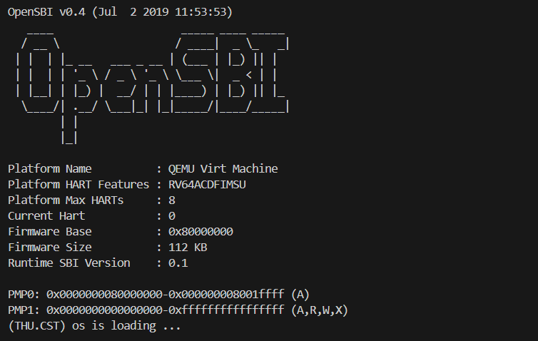
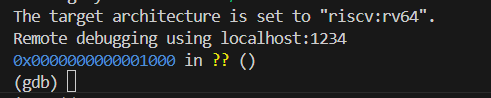

# LAB1

**23级信息安全  2310411 李听泉**

**23级信息安全  2313876 李子凝**

**23级信息安全  2312092 李朝阳**

> [!NOTE] 
>
> **小组分工：**
>
> 李子凝：练习1+练习2的复位地址处+实验中有但OS原理中不突出的知识点这三个部分；
>
> 李朝阳：练习2的OpenSBI部分+OS原理重要但实验未涉及的知识点两个部分；
>
> 李听泉：练习2的内核入口点部分+总结练习2问题答案+实验中重要知识点与OS原理对应关系三个部分；
----

## 练习1：理解内核启动中的程序入口操作

> 阅读 kern/init/entry.S内容代码，结合操作系统内核启动流程，说明指令 la sp, bootstacktop 完成了什么操作，目的是什么？ tail kern_init 完成了什么操作，目的是什么？

结合操作系统内核启动流程，首先我们来分析`kern/init/entry.S`代码文件的作用。在我们使用的链接脚本`tools/kernel.ld`中指定程序的入口点为`kern_entry`，而该入口点正是在`entry.S`中定义的。`kern_entry`的主要作用是设置栈指针，分配内核栈空间，从而为C代码的运行创造最基本的条件，从而可以执行C 语言编写的`kern_init`函数，完成从汇编环境到C语言环境的安全过渡。

`kern_entry`代码段的指令有两条：

```assembly
kern_entry: 
    la sp, bootstacktop
    tail kern_init
```

接下来我们就依次分析这两条关键指令的操作及目的：

#### **问题1：`la sp, bootstacktop` 完成了什么操作，目的是什么？**

**操作：**

`la` 指令将符号 `bootstacktop` （栈顶）的地址加载到 `sp` 栈指针寄存器中。

在`entry.S`中data段的相关数据如下：

```assembly
.section .data
    .align PGSHIFT #按照2^PGSHIFT进行地址对齐, 也就是对齐到下一页 PGSHIFT在 mmu.h定义
    .global bootstack #内核栈
bootstack:
    .space KSTACKSIZE #留出KSTACKSIZE这么多个字节的内存
    .global bootstacktop #之后内核栈将要从高地址向低地址增长, 初始时的内核栈为空
bootstacktop:
```

首先对齐到下一页，然后开始分配栈，标签`bootstack`处于低地址作为栈底。接着通过.space语句在当前位置留出KSTACKSIZE个字节的内存，这块内存就是实实在在的内核栈。在此定义global标签`bootstacktop`，以此高地址端作为栈顶。

因此，具体来说，该条指令就是把在 `entry.S` 底部通过 `.space KSTACKSIZE` 分配的内核栈空间的顶端地址赋给 `sp`。

**目的：**

C 语言函数严重依赖栈来存储局部变量、传递参数、保存返回地址等。没有正确初始化的栈，C 函数无法正常工作。这条指令就是从汇编环境跳转到 C 语言环境的必备前提，为后续C语言代码（如init.c、sbi.c等）的执行建立运行时栈环境。

#### 问题2：`tail kern_init` 完成了什么操作，目的是什么？

**操作：**

`tail` 是一条优化的跳转指令，执行尾调用。它直接跳转到 `kern_init` 函数的地址，并且不保存返回地址到链接寄存器 (`ra`)。

**目的：**

因为无需再返回`kern_entry`，tail语句干净利落地将控制权从汇编启动代码移交给我们用 C 语言编写的主内核初始化函数，跳转至`kern_init`。

**为什么该函数不返回？**

- **内核初始化过程的单向性** ： kern_init 是内核初始化函数，它的执行是操作系统启动流程的开始， 理论上不应该返回 。一旦成功完成初始化，系统将进入主循环或等待中断；如果初始化失败，系统也无法回到启动前的状态；
- **避免无意义的资源浪费** ：如果保存返回地址，这个地址永远不会被使用，纯粹是浪费了 ra 寄存器资源和栈空间；
- **简化执行流程** ：通过`tail`进行函数调用，`kern_init` 可以直接复用当前的栈帧，避免了函数调用和返回的开销。

> [!TIP]
>
> 同样的在`kern/init/init.c`中也有一行代码，这里的作用也是不保存函数的返回地址，这里为什么需要将不保存返回地址的事情重复两遍？
>
> ```c++
> int kern_init(void) __attribute__((noreturn));
> ```
>
> 查询资料以后我们得知这是因为这是两个不同层次的声明，具体如下：
>
> 1. `__attribute__((noreturn))` - **编译时信息**
>
> ```c
> int kern_init(void) __attribute__((noreturn));
> ```
>
> 这是给**编译器**看的信息，目的是告诉编译器这个函数不会返回，编译器可以据此进行优化。
>
> 2. `tail kern_init` - **运行时行为**
>
> ```assembly
> tail kern_init
> ```
>
> 这是**实际的运行时行为**，目的是不压入返回地址，直接跳转，同时避免了不必要的栈空间的使用。

-----

## 练习2: 使用GDB验证启动流程

> 为了熟悉使用 QEMU 和 GDB 的调试方法，请使用 GDB 跟踪 QEMU 模拟的 RISC-V 从加电开始，直到执行内核第一条指令（跳转到 0x80200000）的整个过程。通过调试，请思考并回答：RISC-V 硬件加电后最初执行的几条指令位于什么地址？它们主要完成了哪些功能？请在报告中简要记录你的调试过程、观察结果和问题的答案。

首先，我们进行环境准备和编译。首先检查工具版本：

```
# 检查工具版本
root@ltq:/mnt/d/oshub/labcode/lab1# qemu-system-riscv64 --version
QEMU emulator version 4.1.1
Copyright (c) 2003-2019 Fabrice Bellard and the QEMU Project developers

root@ltq:/mnt/d/oshub/labcode/lab1# riscv64-unknown-elf-gdb --version
GNU gdb (SiFive GDB-Metal 10.1.0-2020.12.7) 10.1
Copyright (C) 2020 Free Software Foundation, Inc.
License GPLv3+: GNU GPL version 3 or later <http://gnu.org/licenses/gpl.html>
This is free software: you are free to change and redistribute it.
There is NO WARRANTY, to the extent permitted by law.

```

接下来我们通过`make qemu`指令启动qemu，加载内核运行ucore，运行结果部分截图如下：



运行成功，实验环境无误。接下来启动调试环境并开始调试。

开启两个终端，一个终端执行指令`make debug`，另一个终端执行指令`make gdb`，GDB启动并显示`(gdb)`提示符：



接下来，我们开始对其进行逐步调试并观察相应结果：

1. #### 复位地址处：

   虚拟CPU一启动就暂停在复位地址0x1000处，该地址是`QEMU`内置的固件`BIOS`代码，执行指令观察并分析该处的代码如下：

   ```assembly
   (gdb) x/10i 0x1000
   => 0x1000:      auipc   t0,0x0		# t0 = 0x1000
      0x1004:      addi    a2,t0,40	# a2 = 0x1028
      0x1008:      csrr    a0,mhartid	# 读取当前硬件线程编号
      0x100c:      ld      a1,32(t0)	# a1 = *(0x1020)
      0x1010:      ld      t0,24(t0)	# t0 = *(0x1018) = 0x80000000
      0x1014:      jr      t0			# 跳转到 t0 指向的地址
      0x1018:      unimp
      0x101a:      .insn   2, 0x8000	# 插入 16 位立即数 0x8000
      0x101c:      unimp
      0x101e:      unimp
   ```

   其中，t0的值为从地址 0x1018 开始的 8 字节所加载出的64 位值，由于是小端序，最终读出来应为0x80000000，即OpenSBI的入口地址。

   该步便是可执行内核启动的第一步：**硬件初始化和固件启动**。QEMU模拟加电复位过程，PC被硬件设置为固定的复位地址0x1000，并在此执行上述一段写死的固件代码MROM。其功能是完成最基本的环境准备并将控制权交给OpenSBI，也就是跳转至物理内存的0x80000000处（0x1014处跳转指令）。

2. #### OpenSBI:

   接着，我们设置两处关键断点，并设置观察点捕捉内核加载。

   ```bash
   (gdb) b *0x80000000	# OpenSBI主要代码区域
   Breakpoint 1 at 0x80000000
   (gdb) b *0x80200000	# 内核入口地址
   Breakpoint 2 at 0x80200000: file kern/init/entry.S, line 7.
   (gdb) watch *0x80200000	# 设置内存观察点
   Hardware watchpoint 3: *0x80200000
   ```

   `continue`执行到第一个断点`0x80000000`处，此时执行指令查看下面10行代码及寄存器状态如下：

   ```bash
   Breakpoint 1, 0x0000000080000000 in ?? ()
   (gdb) x/10i $pc
   => 0x80000000:  add     s0,a0,zero	# s0 = a0
      0x80000004:  add     s1,a1,zero	# s1 = a1
      0x80000008:  add     s2,a2,zero	# s2 = a2
      0x8000000c:  jal     0x80000560	# 调用子程序
      0x80000010:  add     a6,a0,zero
      0x80000014:  add     a0,s0,zero
      0x80000018:  add     a1,s1,zero
      0x8000001c:  add     a2,s2,zero
      0x80000020:  li      a7,-1
      0x80000022:  beq     a6,a7,0x8000002a
   (gdb) info registers sp pc ra a0 a1
   sp             0x0      0x0
   pc             0x80000000       0x80000000
   ra             0x0      0x0
   a0             0x0      0
   a1             0x87000000       2264924160
   ```

   现在正处于OpenSBI的启动入口，前四条指令是 OpenSBI 在保存传入参数 (a0–a2)，并调用它的主初始化函数。寄存器值及相应分析如下：

   | 寄存器及值      | 含义                                         |
   | --------------- | -------------------------------------------- |
   | `pc=0x80000000` | 当前执行地址（OpenSBI入口）                  |
   | `a0=0x0`        | 当前硬件核编号（hartid=0）                   |
   | `a1=0x87000000` | 指向设备树（FDT）的地址                      |
   | `a2`            | 从上级传入（未显示，可能为启动参数结构指针） |
   | `sp=0x0`        | 栈尚未初始化（说明还在非常早期阶段）         |
   | `ra=0x0`        | 表示当前函数为启动入口，不会返回             |

   为了看到栈何时被初始化，我们在寄存器\$sp上也设置一个观察点，以便在\$sp值发生变化时自动中断执行。执行以下指令：

   ```bash
   (gdb) watch $sp	# 设置观察点
   Watchpoint 4: $sp
   (gdb) c	# 继续执行
   Continuing.
   
   Watchpoint 4: $sp
   
   Old value = (void *) 0x0
   New value = (void *) 0x8003f000
   0x000000008000012e in ?? ()
   ```

   可以看到，在pc值为0x8000012e处，寄存器\$sp的值被更改，完成栈的初始化。打印出该条指令上面的部分代码，对其实现的包括设置栈顶在内的关键操作进行分析如下：

   ```bash
   0x800000e2:  auipc   t0,0x17            # 计算全局启动标志变量高位地址
   0x800000e6:  addi    t0,t0,-210         # 调整偏移得到精确地址
   0x800000ea:  li      t1,1               # t1 = 1，准备写入启动标志
   0x800000ec:  sd      t1,0(t0)           # *(t0) = 1，标记主核已启动
   0x800000f0:  fence   rw,rw              # 内存屏障，确保写操作对其他 hart 可见
   0x800000f4:  li      ra,0               # ra = 0，清除返回地址寄存器
   0x800000f6:  jal     0x80000518         # 跳转到早期初始化函数（OpenSBI early init）
   # 计算 .bss 起止并清零
   0x800000fa:  auipc   s4,0x1a            # 计算 .bss 段起始地址高位
   0x800000fe:  addi    s4,s4,-250         # .bss 起点
   0x80000102:  auipc   s5,0x3d            # 计算 .bss 段结束地址高位
   0x80000106:  addi    s5,s5,-922         # .bss 终点
   0x8000010a:  sd      zero,0(s4)         # *(s4) = 0，清零8字节（bss清零循环）
   0x8000010e:  addi    s4,s4,8            # s4 += 8，指向下一个 8 字节
   0x80000110:  blt     s4,s5,0x8000010a   # 若 s4 < s5 则继续清零（循环）
   # 设置异常向量 mtvec
   0x80000114:  auipc   s4,0x0             # 计算 trap 向量基址高位（用于 mtvec）
   0x80000118:  addi    s4,s4,740          # s4 = 0x800003f8，异常入口地址
   0x8000011c:  csrw    mtvec,s4           # 设置机器模式异常入口（mtvec）
   # 计算并设置栈顶
   0x80000120:  auipc   s4,0x3d            # 栈基址高位（stack base）
   0x80000124:  addi    s4,s4,-288         # s4 = 0x8003d000，当前 hart 栈基址
   0x80000128:  lui     s5,0x2             # s5 = 0x2 << 12 = 0x2000，栈偏移
   0x8000012a:  add     sp,s4,s5           # sp = s4 + s5 =0x8003f000，设置栈顶
   # 保存参数并进入后续 C 初始化
   0x8000012e:  add     s0,a0,zero         # 保存启动参数 a0 → s0（hartid 等）
   0x80000132:  add     s1,a1,zero         # 保存 a1（可能是 dtb 地址）
   0x80000136:  add     s2,a2,zero         # 保存 a2（可能是 boot 参数）
   0x8000013a:  add     s3,a3,zero         # 保存 a3
   0x8000013e:  add     s4,a4,zero         # 保存 a4
   0x80000142:  jal     0x80000588         # 跳转进入更高层初始化
   ```

   这部分代码依次实现了**启动标志设置、内存同步与早期初始化、清空.bss段、设置异常向量、设置栈顶**等关键功能。栈顶指针`$sp`正是在执行0x8000012a地址指令后被初始化。

3. #### 内核入口点：

   接着执行`c`，程序在预先设置的观察点`0x80200000`处暂停。

  ```bash
  (gdb) c
  Continuing.
  
  Breakpoint 2, kern_entry () at kern/init/entry.S:7
  7           la sp, bootstacktop
  ```

  此时程序已进入到内核入口点，我们打印当前指令之后的十条指令及当前寄存器信息，进行分析如下：

  ```bash
  (gdb) x/10i $pc
  # 进入程序kern/init/entry.S
  # 对应语句la sp, bootstacktop
  => 0x80200000 <kern_entry>:     auipc   sp,0x3	
  	# 将PC的高20位与0x3组合，计算bootstacktop的地址
     0x80200004 <kern_entry+4>:   mv      sp,sp	
     	# 应该是优化后的结果，实际是加载bootstacktop到sp
  # 对应语句tail kern_init
     0x80200008 <kern_entry+8>:   j       0x8020000a <kern_init>
     
  # 进入kern_init函数（进入程序kern/init/init.c）
     0x8020000a <kern_init>:      auipc   a0,0x3		# 计算edata的地址
     0x8020000e <kern_init+4>:    addi    a0,a0,-2	# 调整edata地址
     0x80200012 <kern_init+8>:    auipc   a2,0x3		# 计算end的地址
     0x80200016 <kern_init+12>:   addi    a2,a2,-10	# 调整end地址
     0x8020001a <kern_init+16>:   addi    sp,sp,-16	# 在栈上分配空间（函数调用准备）
     0x8020001c <kern_init+18>:   li      a1,0		# 设置memset的填充值0
     0x8020001e <kern_init+20>:   sub     a2,a2,a0	# 计算.bss段大小：end - edata
  (gdb) info registers a0 a1 a2 sp pc ra
  a0             0x0      0
  a1             0x82200000       2183135232	# 设备树DTB地址（由OpenSBI传递）
  a2             0x80200000       2149580800
  sp             0x8001bd80       0x8001bd80	# 当前栈指针（还在OpenSBI的栈中）
  pc             0x80200000       0x80200000 <kern_entry>	# 当前执行位置
  ra             0x80000a02       0x80000a02	# 返回地址（指向OpenSBI代码）
  ```

  打印出的之后的指令清晰地展示了源文件`kern/init/entry.S`中的两条关键指令的实现（设置当前栈顶并跳转至`kern_init`），同时也清晰地展示了程序`kern/init/init.c`中`kern_init`函数前面调用memset函数清除.bss段的底层实现，进行内核环境的初始化。

  由于此时刚由OpenSBI跳转至此，栈指针还在OpenSBI的栈中。接着，继续执行指令完成内核栈顶的初始化，观察栈指针变化如下：

  ```bash
  (gdb) ni
  0x0000000080200004 in kern_entry () at kern/init/entry.S:7
  7           la sp, bootstacktop
  (gdb) ni
  9           tail kern_init
  (gdb) info registers sp
  sp             0x80203000       0x80203000 <SBI_CONSOLE_PUTCHAR>
  ```

  可以看到栈指针成功被初始化指向地址`0x80203000`。同时，有趣的是，`0x80203000`刚好也是全局变量`<SBI_CONSOLE_PUTCHAR>`的地址，因此被GDB显示。为了进一步探索内存布局的关系，我又重新分析了链接脚本`kernel.ld`及各个程序之间的位置关系，整理出上面各个关键变量实际布局图如下：

  0x80200000: +-----------------------------------------------+  ← BASE_ADDRESS
              			| **.text**         									     |
              			|  	代码部分        						      |
              			+-----------------------------------------------+  ← etext
              			| **.rodata**         									|
             			 |  	只读数据       							   |
            			  +-----------------------------------------------+
           			   | 	对齐到4KB边界   						 |
             			 +-----------------------------------------------+
             			 | **.data**        									     |
              			|   	bootstack     						      | 
             			 |    	 ...        								 	   |
           			   |  	 bootstacktop  						    | ← sp = 0x80203000
       			       |  	 SBI_CONSOLE_PUTCHAR=1     | ← 在.data段  
            			  |   ...         										     |
            			  +-----------------------------------------------+  ← edata
            			  | **.bss**          										  |
           			   |   	其他初始为0的变量 				   |
          			    +-----------------------------------------------+  ← end

以上便是在调试过程中对三个关键点的观察结果及分析。

#### 问题：RISC-V 硬件加电后最初执行的几条指令位于什么地址？它们主要完成了哪些功能？

基于上述实际的调试结果和分析，RISC-V硬件加电后最初执行的指令及功能如下：

##### 1. **指令地址：0x1000**

通过GDB调试确认，CPU从复位地址**0x1000**开始执行。

##### 2. **最初几条指令的详细功能分析**

实际观察到的指令序列及功能：

```assembly
0x1000: auipc   t0,0x0        # 设置基地址：t0 = 0x1000
0x1004: addi    a2,t0,40      # 准备参数：a2 = 0x1028（可能用于设备树或配置）
0x1008: csrr    a0,mhartid    # 读取硬件线程ID：a0 = 当前CPU核心编号
0x100c: ld      a1,32(t0)     # 加载参数：a1 = *(0x1020)（设备树DTB地址）
0x1010: ld      t0,24(t0)     # 加载目标地址：t0 = *(0x1018) = 0x80000000
0x1014: jr      t0            # 跳转到OpenSBI入口：PC = 0x80000000
```

##### 3. **完成的核心功能**

###### **功能1：基础环境准备**

- 设置地址基址寄存器t0。
- 读取当前CPU核心的硬件线程ID（即代码中的mhartid）。

###### **功能2：启动参数传递**

- 准备设备树地址（a1 = 0x82200000，从0x1020处加载）。
- 设置其他可能的配置参数（a2 = 0x1028）。

###### **功能3：控制权移交**

- 从固定地址0x1018加载OpenSBI入口地址0x80000000。
- 执行跳转指令，将控制权交给OpenSBI固件。

##### 4. **在整个启动流程中的位置**

```
加电复位
    ↓
0x1000: QEMU固件代码 (MROM)
    ↓ (基础硬件信息收集)
0x80000000: OpenSBI固件  
    ↓ (完整硬件初始化)
0x80200000: 操作系统内核
```

**总结：RISC-V硬件加电后从地址0x1000开始执行，主要完成最基础的CPU环境准备、硬件信息收集，并通过寄存器传递参数后跳转到OpenSBI固件继续后续的启动流程。**

------

## 实验中的重要知识点与OS原理对应关系

本次实验主要讲解最小可执行内核和启动流程，以下是在做实验过程中的重要知识点与对应OS原理之间的对应关系：

#### 1. **系统启动流程**

| 实验知识点                            | OS原理知识点     | 含义、关系与差异                                             |
| :------------------------------------ | :--------------- | :----------------------------------------------------------- |
| 复位向量(0x1000) → OpenSBI → 内核入口 | 系统引导过程     | **含义**：实验展示了从硬件加电到OS内核执行的完整链条 。<br />**关系**：实验是原理的具体实现，验证了Bootloader的作用 。<br />**差异**：原理讨论通用引导概念，实验展示RISC-V特定实现(MROM→OpenSBI)。 |
| 内核加载地址0x80200000                | 内核地址空间布局 | **含义**：内核在内存中的固定起始位置 。<br />**关系**：实验体现了链接脚本与物理内存规划的配合。 <br />**差异**：原理关注虚拟内存布局，实验关注实际的物理加载地址。 |

#### 2. **执行环境建立**

| 实验知识点                          | OS原理知识点 | 含义、关系与差异                                             |
| :---------------------------------- | :----------- | :----------------------------------------------------------- |
| 栈指针初始化(`la sp, bootstacktop`) | 进程执行环境 | **含义**：为C代码运行准备栈空间 。<br />**关系**：实验展示了OS内核自身执行环境的建立。<br /> **差异**：原理讨论用户进程环境，实验关注内核自身环境，栈空间其实就是程序自身数据段的一部分，而不是通过指令去映射或操纵的其他独立空间。 |
| 汇编到C语言的切换(`tail kern_init`) | 运行模式切换 | **含义**：从底层硬件操作切换到高级语言逻辑 。<br />**关系**：实验验证了模式切换的技术实现 。<br />**差异**：原理包含更多上下文切换，实验是简单的控制流转移。 |

#### 3. **内存管理基础**

| 实验知识点                                 | OS原理知识点 | 含义、关系与差异                                             |
| :----------------------------------------- | :----------- | :----------------------------------------------------------- |
| BSS段清零(`memset(edata, 0, end - edata)`) | 内存初始化   | **含义**：清理未初始化数据段 。<br />**关系**：实验体现了程序内存布局的实际管理 。<br />**差异**：原理讨论动态内存管理，实验是静态内存初始化。 |
| 链接脚本内存布局                           | 地址空间管理 | **含义**：控制各段在内存中的位置。<br /> **关系**：实验是链接时地址空间规划的具体实践。<br /> **差异**：原理关注运行时管理，实验关注编译时布局。 |

#### 4. **系统调用机制**

| 实验知识点           | OS原理知识点 | 含义、关系与差异                                             |
| :------------------- | :----------- | :----------------------------------------------------------- |
| SBI调用(`ecall`指令) | 系统调用接口 | **含义**：用户态/内核态与固件的交互机制。<br /> **关系**：实验展示了最底层的系统调用实现。<br /> **差异**：原理讨论完整的syscall流程，实验只有M→S模式切换。 |
| 内联汇编封装         | 硬件抽象层   | **含义**：通过封装隐藏硬件细节。<br /> **关系**：实验体现了硬件抽象的设计思想。<br /> **差异**：原理讨论完整的HAL，实验是简单的指令封装。 |

#### 5. **设备与驱动**

| 实验知识点      | OS原理知识点 | 含义、关系与差异                                             |
| :-------------- | :----------- | :----------------------------------------------------------- |
| 设备树(DTB)传递 | 硬件资源发现 | **含义**：动态获取硬件配置信息。<br /> **关系**：实验验证了设备树的实际使用 。<br />**差异**：原理讨论多种探测方式，实验只涉及设备树机制。 |

-----

## 实验中有但OS原理中不突出的知识点

#### 1. **链接器脚本的作用**

- **实验体现**：通过`kernel.ld`精确控制内存布局。
- **原理缺失**：OS原理课程很少深入讨论链接阶段的细节（包括如何定义、如何链接等）。
- **重要性**：理解内核与应用程序在链接时的差异。

#### 2. **RISC-V特定架构细节**

- **实验体现**：复位地址0x1000、ecall指令、CSR寄存器。
- **原理缺失**：原理课程通常架构无关，并没有提到这些架构中真实使用的命令。
- **重要性**：了解具体架构对OS设计的影响。

#### 3. **固件层(OpenSBI)的作用**

- **实验体现**：MROM → OpenSBI → Kernel的层次结构。
- **原理缺失**：传统OS原理直接从Bootloader开始。
- **重要性**：理解现代安全启动和特权级隔离。

-------

## OS原理重要但实验未涉及的知识点

#### 1. **进程管理与调度**

该部分是我们这几周重点讲述的部分，但在此次实验中没有涉及。

##### 原理核心概念：

进程是OS资源分配的基本单位，调度是OS的核心功能。

##### 进程描述与管理：

```c
// 原理中的进程控制块(PCB)
struct task_struct {
    int pid;                    // 进程ID
    volatile long state;        // 进程状态
    void *stack;                // 内核栈
    struct mm_struct *mm;       // 内存管理结构
    struct thread_struct thread;// 线程上下文
    struct list_head tasks;     // 进程链表
    // ... 其他资源信息
};
```

##### 进程状态转换

```
新建 → 就绪 ↔ 运行 → 阻塞
         ↑         |
         └─────────┘
```

**实验缺失**：当前内核只有一个执行流，没有多进程概念。

##### 调度算法

- **先来先服务(FCFS)**：简单但平均等待时间波动较大，I/O资源和CPU资源的利用率较低。
- **短进程优先(SPN)**：具有最优平均周转时间但需要预知运行时间。
- **时间片轮转(RR)**：公平性强，响应时间好。
- **多级反馈队列(MLFQ)**：结合多种策略优点。

##### 与实验的关系：

实验中的`kern_init`可以看作是内核线程，但缺少：

- 进程创建(`fork()`/`exec()`)
- 进程间隔离
- 调度决策机制

#### 2. **虚拟内存管理**

##### 原理核心概念：

为每个进程提供独立的地址空间，实现内存保护和共享。

##### 地址转换机制:

```
虚拟地址 → [MMU+页表] → 物理地址
```

##### 页表结构:

以下是AI向我展示的多级页表实际代码定义示例：

```c
// 多级页表示例（x86-64）
typedef struct {
    uint64_t entries[512];  // 每个页表512项
} page_table_t;

// 页表项标志位
#define PTE_PRESENT   (1 << 0)
#define PTE_WRITABLE  (1 << 1) 
#define PTE_USER      (1 << 2)
#define PTE_ACCESSED  (1 << 5)
#define PTE_DIRTY     (1 << 6)
```

##### 缺页处理流程:

```c
// 缺页异常处理
void page_fault_handler(struct pt_regs *regs) {
    uint64_t fault_addr = read_csr(stval);
    uint64_t cause = read_csr(scause);
    
    if (!find_vma(current, fault_addr)) {
        // 段错误 - 访问未分配区域
        kill_process(current, SIGSEGV);
    } else if (page_not_present(fault_addr)) {
        // 请求调页 - 从磁盘加载
        do_swapin(fault_addr);
    } else if (access_violation(cause)) {
        // 权限错误 - 写只读页等
        handle_protection_fault(fault_addr);
    }
}
```

在课堂讲述的PPT中，发生缺页异常时具体的处理过程为：

1. CPU发出访存指令到MMU，MMU根据地址高位部分得到页号，以页号查页表；
2. 查表发现该页表项未填入有效值，因此产生缺页异常；
3. 缺页异常由OS响应，OS需要分配对应的页帧，并找到该页内容在磁盘中的位置；
4. 找到系统中的空闲页帧，并取得页帧号，将页帧号填入页表中，并修改页表的有效位；
5. 异常返回，重新执行产生缺页的指令，并且不再触发异常。

##### 与实验的关系：

实验目前使用**物理地址直接访问**，缺少：

- 页表初始化和管理
- 地址空间隔离
- 按需分页和交换机制

除此之外，通过查阅资料，发现实验中缺少的还有其他OS的关键部分，由于我们课程还没学到，这部分借助AI对其进行学习。

#### 3. **文件系统**

##### 原理核心概念：

组织和管理存储设备上的数据，提供持久化存储。

##### 文件系统层次结构：

```
用户程序 → 系统调用接口 → 虚拟文件系统(VFS) → 具体文件系统 → 块设备驱动
```

##### 关键数据结构：

```c
// 虚拟文件系统接口
struct inode_operations {
    int (*create)(struct inode *, struct dentry *, umode_t, bool);
    struct dentry *(*lookup)(struct inode *, struct dentry *, unsigned int);
    int (*link)(struct dentry *, struct inode *, struct dentry *);
    // ... 其他文件操作
};

struct file_operations {
    ssize_t (*read)(struct file *, char __user *, size_t, loff_t *);
    ssize_t (*write)(struct file *, const char __user *, size_t, loff_t *);
    int (*open)(struct inode *, struct file *);
    int (*release)(struct inode *, struct file *);
    // ... 其他操作
};
```

##### 文件存储方式：

- **连续分配**：简单但易产生外部碎片
- **链接分配**：无外部碎片但随机访问慢
- **索引分配**：支持随机访问，索引块开销

##### 与实验的关系：

实验目前**完全没有文件系统**，缺少：

- 存储设备驱动
- 文件抽象和目录结构
- 磁盘空间管理

#### 4. **并发与同步**

##### 原理核心概念：

协调多个执行流对共享资源的访问，避免竞态条件。

##### 临界区问题：

```c
// 不正确的共享资源访问
int counter = 0;

void *thread_func(void *arg) {
    for (int i = 0; i < 1000000; i++) {
        counter++;  // 非原子操作，可能丢失更新
    }
    return NULL;
}
```

##### 同步机制：

```c
// 1. 互斥锁
pthread_mutex_t lock = PTHREAD_MUTEX_INITIALIZER;
pthread_mutex_lock(&lock);
// 临界区
pthread_mutex_unlock(&lock);

// 2. 信号量
sem_t semaphore;
sem_init(&semaphore, 0, 1);
sem_wait(&semaphore);  // P操作
// 临界区  
sem_post(&semaphore);  // V操作

// 3. 条件变量
pthread_cond_t cond = PTHREAD_COND_INITIALIZER;
pthread_cond_wait(&cond, &lock);  // 等待条件
pthread_cond_signal(&cond);       // 通知等待者
```

##### 死锁处理：

- **预防**：破坏死锁四个必要条件之一
- **避免**：银行家算法，安全状态检测
- **检测与恢复**：资源分配图检测，进程终止或回滚

##### 与实验的关系：

实验目前**单线程顺序执行**，缺少：

- 多线程环境
- 共享资源保护
- 死锁预防和检测

#### 5. **设备驱动框架**

##### 原理核心概念：

统一管理硬件设备，为上层提供标准接口。

##### 设备分类与管理：

```c
// 字符设备
struct cdev {
    struct kobject kobj;
    struct module *owner;
    const struct file_operations *ops;
    struct list_head list;
    dev_t dev;
    unsigned int count;
};

// 块设备
struct block_device {
    dev_t bd_dev;
    struct gendisk *bd_disk;
    struct request_queue *bd_queue;
    // ... 其他块设备特定字段
};
```

##### I/O调度：

```c
// 电梯调度算法示例
void elevator_schedule(struct request_queue *q) {
    struct request *req;
    
    // 1. 合并相邻请求
    if ((req = elv_former_request(q, current_req))) {
        if (merge_requests(req, current_req))
            return;
    }
    
    // 2. 按磁道顺序调度
    sort_requests_by_sector(q);
    
    // 3. 处理下一个请求
    process_next_request(q);
}
```

##### 中断处理：

```c
// 中断处理例程
irqreturn_t interrupt_handler(int irq, void *dev_id) {
    // 1. 读取设备状态
    uint32_t status = readl(device_base + STATUS_REG);
    
    // 2. 处理中断
    if (status & DATA_READY) {
        handle_data_ready();
    }
    if (status & TRANSFER_COMPLETE) {
        handle_transfer_complete();
    }
    
    // 3. 确认中断处理
    writel(status, device_base + STATUS_REG);
    return IRQ_HANDLED;
}
```

##### 与实验的关系：

实验只有**最简单的SBI封装**，缺少：

- 真实设备驱动模型
- 中断处理机制
- I/O调度策略
