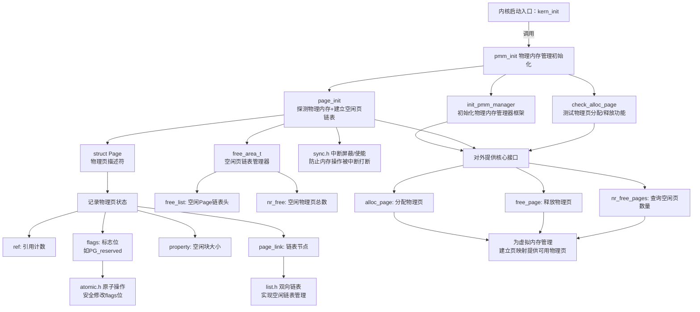

# 实验二：物理内存管理

对实验报告的要求：
 - 基于markdown格式来完成，以文本方式为主
 - 填写各个基本练习中要求完成的报告内容
 - 完成实验后，请分析ucore_lab中提供的参考答案，并请在实验报告中说明你的实现与参考答案的区别
 - 列出你认为本实验中重要的知识点，以及与对应的OS原理中的知识点，并简要说明你对二者的含义，关系，差异等方面的理解（也可能出现实验中的知识点没有对应的原理知识点）
 - 列出你认为OS原理中很重要，但在实验中没有对应上的知识点

#### 练习1：理解first-fit 连续物理内存分配算法（思考题）
first-fit 连续物理内存分配算法作为物理内存分配一个很基础的方法，需要同学们理解它的实现过程。请大家仔细阅读实验手册的教程并结合`kern/mm/default_pmm.c`中的相关代码，认真分析default_init，default_init_memmap，default_alloc_pages， default_free_pages等相关函数，并描述程序在进行物理内存分配的过程以及各个函数的作用。
请在实验报告中简要说明你的设计实现过程。请回答如下问题：
- 你的first fit算法是否有进一步的改进空间？

#### 练习2：实现 Best-Fit 连续物理内存分配算法（需要编程）
在完成练习一后，参考kern/mm/default_pmm.c对First Fit算法的实现，编程实现Best Fit页面分配算法，算法的时空复杂度不做要求，能通过测试即可。
请在实验报告中简要说明你的设计实现过程，阐述代码是如何对物理内存进行分配和释放，并回答如下问题：
- 你的 Best-Fit 算法是否有进一步的改进空间？

#### 扩展练习Challenge：buddy system（伙伴系统）分配算法（需要编程）

Buddy System算法把系统中的可用存储空间划分为存储块(Block)来进行管理, 每个存储块的大小必须是2的n次幂(Pow(2, n)), 即1, 2, 4, 8, 16, 32, 64, 128...

 -  参考[伙伴分配器的一个极简实现](http://coolshell.cn/articles/10427.html)， 在ucore中实现buddy system分配算法，要求有比较充分的测试用例说明实现的正确性，需要有设计文档。

#### 扩展练习Challenge：任意大小的内存单元slub分配算法（需要编程）

slub算法，实现两层架构的高效内存单元分配，第一层是基于页大小的内存分配，第二层是在第一层基础上实现基于任意大小的内存分配。可简化实现，能够体现其主体思想即可。

 - 参考[linux的slub分配算法/](http://www.ibm.com/developerworks/cn/linux/l-cn-slub/)，在ucore中实现slub分配算法。要求有比较充分的测试用例说明实现的正确性，需要有设计文档。

#### 扩展练习Challenge：硬件的可用物理内存范围的获取方法（思考题）
  - 如果 OS 无法提前知道当前硬件的可用物理内存范围，请问你有何办法让 OS 获取可用物理内存范围？


> Challenges是选做，完成Challenge的同学可单独提交Challenge。完成得好的同学可获得最终考试成绩的加分。

## 物理内存管理

### 基本原理概述

#### 物理内存管理

在计算机系统的最底层，物理内存由一系列具有实际地址的存储单元构成。每个内存单元都拥有唯一的物理地址，CPU通过地址总线直接发送这些物理地址来访问内存数据。在简单系统中，程序指令中的内存地址（如`MOV [0x80200000], %eax`）会直接被CPU当作物理地址发送到内存总线上，这种方式实现了最直接的内存访问。

然而，当多个程序需要共享内存空间时，这种直接访问物理地址的方式会面临严重问题。首先，如果内核和用户程序都试图访问相同的物理地址（如`0x80200000`），就会产生冲突，导致数据被意外修改或破坏。更重要的是，这种内存管理方式对内存连续性有着苛刻的要求——每个程序都需要获得连续的内存空间才能运行。

由于程序对连续内存空间的需求，物理内存很容易产生碎片化问题。即使系统中总的空闲内存容量足够，但如果这些空闲内存分散成多个不连续的小块，程序仍然可能因为找不到足够的连续空间而无法运行。这种对连续性的强烈依赖，使得简单物理内存管理在复杂系统中难以有效工作。

那么如何消除这种影响呢？大家显然可以想象得到，我们可以通过让用户程序访问的`0x80200000`和内核访问的`0x80200000`不是一个地址来解决这个问题。但是如果我们只有一块内存，那么为了创造两个不同的地址空间，我们可以引入一个”翻译“机制：程序使用的地址需要经过一步”翻译“才能变成真正的内存的物理地址。这个”翻译“过程，我们可以用一个”词典“实现。通过这个”词典“给出翻译之前的地址，可以在词典里查找翻译后的地址。而对每个程序往往都有着唯一的一本”词典“，而它能使用的内存也就只有他的”词典“所包含的。

”词典“是否对能使用的每个字节都进行翻译？我们可以想象，存储每个字节翻译的结果至少需要一个字节，那么使用1MB的内存将至少需要构造1MB的”词典“，这效率太低了。观察到，一个程序使用内存的数量级通常远大于字节，至少以KB为单位（所以上古时代的人说的是”640K对每个人都够了“而不是”640B对每个人都够了"）。那么我们可以考虑，把连续的很多字节合在一起翻译，让他们翻译前后的数值之差相同，这就是“页”。

#### 物理地址和虚拟地址

在本次实验中，我们使用的是RISCV的`sv39`页表机制，每个页的大小是4KB，也就是4096个字节。通过之前的介绍，相信大家对物理地址和虚拟地址有了一个初步的认识了，页表就是那个“词典”，里面有程序使用的虚拟页号到实际内存的物理页号的对应关系，但并不是所有的虚拟页都有对应的物理页。虚拟页可能的数目远大于物理页的数目，而且一个程序在运行时，一般不会拥有所有物理页的使用权，只会占用部分物理页，这些物理页再通过页表映射到虚拟地址空间中。

分页机制的一个重要优势在于，它带来了地址管理的灵活性。程序员只需要面对一个连续的虚拟地址空间，而不需要关心底层物理内存是否连续。不同程序使用的虚拟地址空间可以相同，但通过页表映射到不同的物理地址，避免了冲突。操作系统还可以通过修改页表，方便地实现内存共享、隔离和换页。

在`sv39`中，定义**物理地址(Physical Address)有 56位，而虚拟地址(Virtual Address) 有 39位**。实际使用的时候，一个虚拟地址要占用 64位，只有低 39位有效，我们规定 63−39 位的值必须等于第 38 位的值（大家可以将它类比为有符号整数），否则会认为该虚拟地址不合法，在访问时会产生异常。不论是物理地址还是虚拟地址，我们都可以认为，最后12位表示的是页内偏移，也就是这个地址在它所在页帧的什么位置（同一个位置的物理地址和虚拟地址的页内偏移相同）。除了最后12位，前面的部分表示的是物理页号或者虚拟页号。

### 实验执行流程概述

本次实验主要完成ucore内核对物理内存的管理工作。我们要对ucore进行相关拓展，修改ucore总控函数kern_init的代码。

#### 启动流程

- kernel在后续执行中能够==探测出的物理内存情况进行物理内存管理初始化工作==。
- **内核核心页表项建立**：其次，我们修改了entry.S中的kern_entry函数。kern_entry函数的主要任务是
  - 设置虚拟内存管理，将三级页表的物理地址和Sv39模式位写入satp寄存器，以建立内核的虚拟内存空间，为之后建立分页机制的过程做一个准备。完成这些工作后，才调用kern_init函数。
- **通用页表项建立**：kern_init函数在完成一些输出后，
  - 将进入物理内存管理初始化的工作，即==调用pmm_init函数完成物理内存的管理==。
  - 接着是执行中断和异常相关的初始化工作，即调用idt_init函数。

#### 物理内存管理的工作

1. 为了完成物理内存管理，这里首先需要探测可用的物理内存资源；了解到物理内存位于什么地方，有多大之后，就以固定页面大小来划分整个物理内存空间，并准备以此为最小内存分配单位来管理整个物理内存，管理在内核运行过程中每页内存，设定其可用状态（free的，used的，还是reserved的），这其实就对应了我们在课本上讲到的连续内存分配概念和原理的具体实现；

2. 接着ucore就要建立页表，启动分页机制，让CPU的MMU把预先建立好的页表中的页表项读入到TLB中，根据页表项描述的虚拟页（Page）与物理页帧（Page Frame）的对应关系完成CPU对内存的读、写和执行操作。这一部分其实就对应了我们在课上讲到内存映射、页表、多级页表等概念和原理的具体实现。

   > [!note]
   >
   > 这里 `预先建立好的页表中的页表项读入到TLB中` ，流程如下：
   >
   > 1. 第一步：物理内存探测（`pmm_init` 函数）
   >    - 输出物理内存页状态表
   > 2. 第二步：页表结构初始化
   >    1. 页表结构：RISCV Sv39 架构要求使用 “三级页表”（根页表→中间页表→叶子页表），每个页表项占 8 字节，每个页表可存储 512 个页表项；
   >    2. 初始化逻辑：
   >       1. 从空闲物理页中分配 3 块物理页帧，分别作为 “根页表”“中间页表”“叶子页表”；
   >       2. 初始化根页表项：将根页表的物理页号写入`satp`寄存器（`kern_entry`函数的任务），告知 MMU “页表的起始位置”；
   >       3. 链接三级页表：在根页表中写入 “中间页表的物理页号”，在中间页表中写入 “叶子页表的物理页号”，形成 “根→中→叶” 的三级索引链
   > 3. 第三步：填充页表项

ucore在实现上述技术时，需要解决两个关键问题：

- 如何建立虚拟地址和物理地址之间的联系
- 如何在现有ucore的基础上实现物理内存页分配算法

接下来将进一步分析完成lab2主要注意的关键问题和涉及的关键数据结构。


### 以页为单位管理物理内存

#### 页表项

一个页表项是用来描述一个虚拟页号如何映射到物理页号的。如果一个虚拟页号通过某种手段找到了一个页表项，并通过读取上面的物理页号完成映射，那么我们称这个虚拟页号通过该页表项完成映射。而我们的”词典“（页表）存储在内存里，由若干个格式固定的”词条“也就是页表项（PTE, Page Table Entry）组成。显然我们需要给词典的每个词条约定一个固定的格式（包括每个词条的大小，含义），这样查起来才方便。

那么在sv39的一个页表项占据8字节（64位），那么页表项结构是这样的：

| 63-54      | 53-28  | 27-19  | 18-10  | 9-8  | 7    | 6    | 5    | 4    | 3    | 2    | 1    | 0    |
| ---------- | ------ | ------ | ------ | ---- | ---- | ---- | ---- | ---- | ---- | ---- | ---- | ---- |
| *Reserved* | PPN[2] | PPN[1] | PPN[0] | RSW  | D    | A    | G    | U    | X    | W    | R    | V    |
| 10         | 26     | 9      | 9      | 2    | 1    | 1    | 1    | 1    | 1    | 1    | 1    | 1    |

我们可以看到 sv39 里面的一个页表项大小为 64 位 8 字节。其中第 53-10 位共44位为一个物理页号，表示这个虚拟页号映射到的物理页号。后面的第 9-0 位共10位则描述映射的状态信息。

介绍一下映射状态信息各位的含义：

- RSW：两位留给 S Mode 的应用程序，我们可以用来进行拓展。
- D：即 Dirty ，如果 D=1 ，表示从上次 D 被清零后开始算起，有虚拟地址通过这个页表项进行写入。
- A，即 Accessed，如果 A=1 ，表示从上次 A 被清零后开始算起，有虚拟地址通过这个页表项进行读、或者写、或者取指。
- G，即 Global，如果 G=1 表示这个页表项是”全局"的，也就是所有的地址空间（所有的页表）都包含这一项。
- U，即 user，U为 1 表示用户态 (U Mode)的程序 可以通过该页表项进映射。在用户态运行时，也只能够通过 U=1 的页表项进行虚实地址映射。 注意，S Mode 不一定可以通过 U=1 的页表项进行映射。我们需要将 S Mode 的状态寄存器 sstatus 上的 SUM 位手动设置为 1 才可以做到这一点（通常情况不会把它置1）。否则通过 U=1 的页表项进行映射也会报出异常。另外，不论sstatus的SUM位如何取值，S Mode都不允许执行 U=1 的页面里包含的指令，这是出于安全的考虑。
- R,W,X 为许可位，分别表示是否可读 (Readable)，可写 (Writable)，可执行 (Executable)。 以 W 这一位为例，如果 W=0 表示不可写，那么如果一条 store 的指令，它通过这个页表项完成了虚拟页号到物理页号的映射，找到了物理地址。但是仍然会报出异常，是因为这个页表项规定如果物理地址是通过它映射得到的，那么不准写入！ R,X也是同样的道理。 根据 R,W,X 取值的不同，我们可以分成下面几种类型：

| X    | W    | R    | Meaning                         |
| ---- | ---- | ---- | ------------------------------- |
| 0    | 0    | 0    | 指向下一级页表的指针            |
| 0    | 0    | 1    | 这一页只读                      |
| 0    | 1    | 0    | *保留(reserved for future use)* |
| 0    | 1    | 1    | 这一页可读可写（不可执行）      |
| 1    | 0    | 0    | 这一页可读可执行（不可写）      |
| 1    | 0    | 1    | 这一页可读可执行                |
| 1    | 1    | 0    | *保留(reserved for future use)* |
| 1    | 1    | 1    | 这一页可读可写可执行            |

- V 表示这个页表项是否合法。如果为 0 表示不合法，此时页表项其他位的值都会被忽略。

#### 多级页表

在实际使用中显然如果只有一级页表，那么我们构建出来的虚拟地址空间还是过于有限，因此我们需要引入多级页表以实现更大规模的虚拟地址空间。

但是相比于可用的物理内存空间，我们的虚拟地址空间太大，不可能为每虚个拟内存页都分配一个页表项。可以简单计算一下，在Sv39中，因为一个页表项占据8字节（64位），而虚拟地址有39位，后12位是页内偏移，那么还剩下27位可以编码不同的虚拟页号。

如果开一个大数组Pagetable[ ], 其中Pagetable[vpn]代表虚拟页号为vpn的虚拟页对应的的页表项，我们给个2^27 的虚拟页号都分配8字节的页表项，那就是整整1 GiB的内存。但这里面其实很多虚拟地址我们没有用到，会有大片大片的页表项的标志位为0（不合法），显然我们不应该为那么多非法页表项浪费宝贵的内存空间。

因此，我们可以对页表进行“分级”，让它变成一个树状结构。也就是把很多页表项组合成一个“大页”，如果这些页表项都非法（没有对应的物理页），那么只需要用一个非法的页表项来覆盖这个大页，而不需要分别建立一大堆非法页表项。很多个大页(megapage)还可以组合起来变成大大页(gigapage!)，继而可以有更大的页，以此类推，当然肯定不是分层越多越好，因为随着层数增多，开销也会越大。

在本次实验中，我们使用的sv39权衡各方面效率，使用三级页表。有4KiB=4096字节的页，大小为2MiB= 2^21 字节的大页，和大小为1 GiB 的大大页。

原先的一个39位虚拟地址，被我们看成27位的页号和12位的页内偏移。那么在三级页表下，我们可以把它看成9位的“大大页页号”，9位的“大页页号”（也是大大页内的页内偏移），9位的“页号”（大页的页内偏移），还有12位的页内偏移。这是一个递归的过程，中间的每一级页表映射是类似的。也就是说，整个Sv39的虚拟内存空间里，有512（2的9次方）个大大页，每个大大页里有512个大页，每个大页里有512个页，每个页里有4096个字节，整个虚拟内存空间里就有512∗512∗512∗4096个字节，是512GiB的地址空间。

那么为啥是512呢？注意，4096/8 = 512，我们恰好可以在一页里放下512个页表项！

我们可以认为，Sv39的多级页表在逻辑上是一棵树，它的每个叶子节点都对应内存的一页，它的每个内部节点都对应512个更低一层的节点，而每个内部节点向更低一层节点的链接都使用内存页中的页表项进行存储。

我们可以根据图示详细理解一下：


Sv39页表的根节点会占据一页4KiB的内存，存储512个页表项（一个页表项占据8字节），分别对应512个1 GiB的大大页。虚拟地址27位页号中的高9位用来在根节点中索引页表项，找到对应的大大页（注意只有合法的页表项才是根节点的儿子，可以跳转到一个物理页号，对应树中一个“大大页”的节点）。

大大页同样是4KiB的内存存储512个页表项，对应512个2MiB的大页，虚拟地址27位页号中的中9位用来在大大页中索引页表项，找到对应的大页的物理页号（同样需要是合法的）。同理，大页的配置与根节点、大大页如出一辙，通过虚拟地址27位页号中的低9位索引大页，便可以找到虚拟地址对应的4KiB物理页，接着用12位页内偏移索引物理页来找到具体的内容。

三级和二级页表项不一定要指向下一级页表。我们知道每个一级页表项控制一个虚拟页号，即控制 4KiB 虚拟内存；每个二级页表项则控制 9 位虚拟页号，总计控制 4KiB×2^9 =2MiB 虚拟内存；每个三级页表项控制 18 位虚拟页号，总计控制 2MiB×2^9 =1GiB 虚拟内存。我们可以将二级页表项的 R,W,X 设置为不是全 0 的许可要求，那么它将与一级页表项类似，只不过可以映射一个 2MiB 的大页 (Mega Page) 。同理，也可以将三级页表项看作一个叶子，来映射一个 1GiB 的大大页(Giga Page)。

#### 页表基址

那么在翻译的过程中，我们如何知道树状页表的根节点的物理地址呢？很多同学可能注意到了，在上面图片中出现的satp，对于RISCV架构，树状页表的根节点的物理地址一般保存在一个特殊寄存器里，就叫做`satp`（Supervisor Address Translation and Protection Register）。

实际上，`satp`里面存的不是最高级页表的起始物理地址，而是它所在的物理页号。除了物理页号，`satp`还包含其他信息。

| 63-60      | 59-44      | 43-0      |
| ---------- | ---------- | --------- |
| MODE(WARL) | ASID(WARL) | PPN(WARL) |
| 4          | 16         | 44        |

MODE表示当前页表的模式：

- 0000表示不使用页表，直接使用物理地址，在简单的嵌入式系统里用着很方便。
- 1000表示sv39页表，也就是我们使用的，虚拟内存空间高达`512GiB`。
- 1001表示Sv48页表，它和Sv39兼容。
- 其他编码保留备用

ASID（address space identifier）我们目前用不到。

OS 可以在内存中为不同的应用分别建立不同虚实映射的页表，并通过修改寄存器 satp 的值指向不同的页表，从而可以修改 CPU 虚实地址映射关系及内存保护的行为。

### 建立快表以加快访问效率

物理内存的访问速度要比 CPU 的运行速度慢很多, 去访问一次物理内存可能需要几百个时钟周期（带来所谓的“冯诺依曼瓶颈”）。如果我们按照页表机制一步步走，将一个虚拟地址转化为物理地址需要访问 3 次物理内存，得到物理地址之后还要再访问一次物理内存，才能读到我们想要的数据。这很大程度上降低了效率。 好在，实践表明虚拟地址的访问具有时间局部性和空间局部性。

- 时间局部性是指，被访问过一次的地址很有可能不远的将来再次被访问；
- 空间局部性是指，如果一个地址被访问，则这个地址附近的地址很有可能在不远的将来被访问。

因此，在 CPU 内部，我们使用快表 (TLB, Translation Lookaside Buffer) 来记录近期已完成的虚拟页号到物理页号的映射。由于局部性，当我们要做一个映射时，会有很大可能这个映射在近期被完成过，所以我们可以先到 TLB 里面去查一下，如果有的话我们就可以直接完成映射，而不用访问那么多次内存了。

## 分页机制的设计思路

#### 建立段页式管理中需要考虑的关键问题

为了实现分页机制，需要建立好虚拟内存和物理内存的页映射关系，即正确建立三级页表。此过程涉及硬件细节，不同的地址映射关系组合，相对比较复杂。总体而言，我们需要思考如下问题：

- 对于哪些物理内存空间需要建立页映射关系？
  - 内核代码与数据所在的物理地址
  - 页表自身所在的物理地址
- 具体的页映射关系是什么？
- 页目录表的起始地址设置在哪里？
- 页表的起始地址设置在哪里，需要多大空间？
- 如何设置页目录表项的内容？
- 如何设置页表项的内容？

#### 实现分页机制

接下来我们就正式开始实验啦！ 首先我们要做的是内核初始化的修改，我们现在需要做的就是把原本只能直接在物理地址空间上运行的内核引入页表机制。 具体来说，我们现在想将内核代码放在虚拟地址空间中以 `0xffffffffc0200000` 开头的一段高地址空间中。那怎么做呢？首先我们需要将下面的参数修改一下：

```
// tools/kernel.ld
BASE_ADDRESS = 0xFFFFFFFFC0200000;
//之前这里是 0x80200000
```

我们修改了链接脚本中的起始地址。但是这样做的话，就能从物理地址空间转移到虚拟地址空间了吗？大家可以分析一下现在我们相当于是在 bootloader 的 OpenSBI 结束后的现状，这样就可以更好的理解接下来我们需要干什么：

- 物理内存状态：OpenSBI 代码放在 `[0x80000000,0x80200000)` 中，内核代码放在以 `0x80200000` 开头的一块连续物理内存中。这个是实验一我们做完后就实现的效果。
- CPU 状态：处于 S Mode ，寄存器 `satp` 的 `MODE`被设置为 `Bare` ，即无论取指还是访存我们都通过物理地址直接访问物理内存。 `PC=0x80200000` 指向内核的第一条指令。栈顶地址 `SP` 处在 OpenSBI 代码内。
- 内核代码：这部分由于改动了链接脚本的起始地址，所以它会认为自己处在以虚拟地址 `0xffffffffc0200000` 开头的一段连续虚拟地址空间中，以此为依据确定代码里每个部分的地址（每一段都是从`BASE_ADDRESS`往后依次摆开的，所以代码里各段都会认为自己在`0xffffffffc0200000`之后的某个地址上，或者说编译器和链接器会把里面的符号/变量地址都对应到`0xffffffffc0200000`之后的某个地址上）

接下来，我们需要修改 `entry.S` 文件来实现内核的初始化，我们在入口点 `entry.S` 中所要做的事情是：将 `SP` 寄存器从原先指向OpenSBI 某处的栈空间，改为指向我们自己在内核的内存空间里分配的栈；同时需要跳转到函数 `kern_init` 中。

在之前的实验中，我们已经在 `entry.S` 自己分配了一块 `8KiB`的内存用来做启动栈：

```asm
#include <mmu.h>
#include <memlayout.h>

    .section .text,"ax",%progbits
    .globl kern_entry
kern_entry:
    la sp, bootstacktop

    tail kern_init

.section .data
    # .align 2^12
    .align PGSHIFT
    .global bootstack
bootstack:
    .space KSTACKSIZE
    .global bootstacktop
bootstacktop:
```

通过之前的实验大家应该都明白：符号 `bootstacktop` 就是我们需要的栈顶地址, 符号 `kern_init` 代表了我们要跳转到的地址。之前我们直接将 `bootstacktop` 的值给到 `SP` ， 再跳转到 `kern_init` 就行了。看上去上面的这个代码也能够实现我们想要的初始化效果，但问题在于，由于我们修改了链接脚本的起始地址，编译器和链接器认为内核开头地址为 `0xffffffffc0200000`，因此这两个符号会被翻译成比这个开头地址还要高的某个虚拟地址。而我们的 CPU 目前还处于 `Bare` 模式，会将地址都当成物理地址处理。这样，我们跳转到 `kern_init`， 就意味着会跳转到比`0xffffffffc0200000`还大的一个物理地址。但物理地址显然不可能有这么多位！这就会出现问题。

于是，我们需要想办法利用刚学的页表知识，帮内核将需要的虚拟地址空间构造出来。也就是：构建一个合适的页表，让`satp`指向这个页表，然后使用地址的时候都要经过这个页表的翻译，使得虚拟地址`0xFFFFFFFFC0200000`经过页表的翻译恰好变成`0x80200000`，这个地址显然就比较合适了，也就不会出错了。

理论知识告诉我们，所有的虚拟地址有一个固定的偏移量。而要想实现页表结构这个偏移量显然是不可或缺的。而虚拟地址和物理地址之间的差值就可以当成是这个偏移量。

比如内核的第一条指令，虚拟地址为 `0xffffffffc0200000` ，物理地址为 `0x80200000` ，因此，我们只要将虚拟地址减去 `0xffffffff40000000` ，就得到了物理地址。所以当我们需要做到去访问内核里面的一个物理地址 `va` 时，而已知虚拟地址为 `va` 时，则 `va` 处的代码或数据就放在物理地址为 `pa = va - 0xffffffff40000000` 处的物理内存中，我们真正所要做的是要让 CPU 去访问 `pa`。因此，我们要通过恰当构造页表，来对于内核所属的虚拟地址，实现这种 `va` 到 `pa` 的映射。

还记得之前的理论介绍的内容吗？那时我们提到，将一个三级页表项的标志位 `R,W,X` 不设为全 `0` ，可以将它变为一个叶子，从而获得大小为 `1GiB` 的一个大页。

我们假定内核大小不超过 `1GiB`，通过一个大页将虚拟地址区间`[0xffffffffc0000000,0xffffffffffffffff]` 映射到物理地址区间 `[0x80000000,0xc0000000)`，而我们只需要分配一页内存用来存放三级页表，并将其最后一个页表项(也就是对应我们使用的虚拟地址区间的页表项)进行适当设置即可。对应的代码如下所示：

```asm
#include <mmu.h>
#include <memlayout.h>

    .section .text,"ax",%progbits
    .globl kern_entry
kern_entry:
    # a0: hartid
    # a1: dtb physical address
    # save hartid and dtb address
    la t0, boot_hartid
    sd a0, 0(t0)
    la t0, boot_dtb
    sd a1, 0(t0)

    # t0 := 三级页表的虚拟地址
    lui     t0, %hi(boot_page_table_sv39)
    # t1 := 0xffffffff40000000 即虚实映射偏移量
    li      t1, 0xffffffffc0000000 - 0x80000000
    # t0 减去虚实映射偏移量 0xffffffff40000000，变为三级页表的物理地址
    sub     t0, t0, t1
    # t0 >>= 12，变为三级页表的物理页号
    srli    t0, t0, 12

    # t1 := 8 << 60，设置 satp 的 MODE 字段为 Sv39
    li      t1, 8 << 60
    # 将刚才计算出的预设三级页表物理页号附加到 satp 中
    or      t0, t0, t1
    # 将算出的 t0(即新的MODE|页表基址物理页号) 覆盖到 satp 中
    csrw    satp, t0
    # 使用 sfence.vma 指令刷新 TLB
    sfence.vma
    # 从此，我们给内核搭建出了一个完美的虚拟内存空间！
    #nop # 可能映射的位置有些bug。。插入一个nop

    # 我们在虚拟内存空间中：随意将 sp 设置为虚拟地址！
    lui sp, %hi(bootstacktop)

    # 我们在虚拟内存空间中：随意跳转到虚拟地址！
    # 跳转到 kern_init
    lui t0, %hi(kern_init)
    addi t0, t0, %lo(kern_init)
    jr t0

.section .data
    # .align 2^12
    .align PGSHIFT
    .global bootstack
bootstack:
    .space KSTACKSIZE
    .global bootstacktop
bootstacktop:

.section .data
    # 由于我们要把这个页表放到一个页里面，因此必须 12 位对齐
    .align PGSHIFT
    .global boot_page_table_sv39
# 分配 4KiB 内存给预设的三级页表
boot_page_table_sv39:
    # 0xffffffff_c0000000 map to 0x80000000 (1G)
    # 前 511 个页表项均设置为 0 ，因此 V=0 ，意味着是空的(unmapped)
    .zero 8 * 511
    # 设置最后一个页表项，PPN=0x80000，标志位 VRWXAD 均为 1
    .quad (0x80000 << 10) | 0xcf # VRWXAD

    .global boot_hartid
boot_hartid:
    .quad 0
    .global boot_dtb
boot_dtb:
    .quad 0
```

总结一下，要进入虚拟内存访问方式，需要如下步骤：

1. 分配页表所在内存空间并初始化页表；
2. 设置好页基址寄存器（指向页表起始地址）；
3. 刷新 TLB。

到现在为止，看上去复杂无比的虚拟内存空间，我们终于得以窥视一二了。

## 物理内存管理的设计思路

#### 物理内存管理的实现

在管理虚拟内存之前，我们首先需要能够管理物理内存，毕竟所有虚拟内存页都要对应到物理内存页才能使用。

不妨把我们的内存管理模块划分为物理内存管理和虚拟内存管理两个模块。

物理内存管理应当为虚拟内存管理提供这样的接口：

- 检查当前还有多少空闲的物理页，返回空闲的物理页数目
- 给出n，尝试分配n个物理页，可以返回一个起始地址和连续的物理页数目，也可能分配一些零散的物理页，返回一个连起来的链表。
- 给出起始地址和n，释放n个连续的物理页

在`kern_init()`里，我们调用一个新函数：`pmm_init()`，`kern_init()`函数我们在之前就有学习过，这里我们只是新增一个调用`pmm_init()`的接口。

```c
// kern/init/init.c
int kern_init(void) {
    extern char edata[], end[];
    memset(edata, 0, end - edata);
    dtb_init();
    cons_init();  // init the console
    const char *message = "(THU.CST) os is loading ...\0";
    //cprintf("%s\n\n", message);
    cputs(message);
    print_kerninfo();
    // grade_backtrace();
    pmm_init();  // init physical memory management
    /* do nothing */
    while (1)
        ;
}
```

那么`pmm_init()`究竟是用来干什么的呢？其实`pmm_init()`主要就是用来主要负责初始化物理内存管理，我们可以在pmm.c文件进行初始化操作。

```c
// kern/mm/pmm.c
/* pmm_init - initialize the physical memory management */
void pmm_init(void) {
    // We need to alloc/free the physical memory (granularity is 4KB or other size).
    // So a framework of physical memory manager (struct pmm_manager)is defined in pmm.h
    // First we should init a physical memory manager(pmm) based on the framework.
    // Then pmm can alloc/free the physical memory.
    init_pmm_manager();

    // detect physical memory space, reserve already used memory,
    // then use pmm->init_memmap to create free page list
    page_init();

    // use pmm->check to verify the correctness of the alloc/free function in a pmm
    check_alloc_page();

    extern char boot_page_table_sv39[]; //我们把汇编里定义的页表所在位置的符号声明进来
    satp_virtual = (pte_t*)boot_page_table_sv39;
    satp_physical = PADDR(satp_virtual);//然后输出页表所在的地址
    cprintf("satp virtual address: 0x%016lx\nsatp physical address: 0x%016lx\n", satp_virtual, satp_physical);
}
check_alloc_page()`是对物理内存分配功能的一个测试。我们重点关注`page_init()
```

我们在lab2增加了一些功能，方便我们编程：

- ==kern/sync/sync.h：为确保内存管理修改相关数据时不被中断打断，提供两个功能，一个是保存 sstatus寄存器中的中断使能位(SIE)信息并屏蔽中断的功能，另一个是根据保存的中断使能位信息来使能中断的功能==
- libs/list.h：定义了通用双向链表结构以及相关的查找、插入等基本操作，这是建立基于链表方法的物理内存管理（以及其他内核功能）的基础。其他有类似双向链表需求的内核功能模块可直接使用 list.h 中定义的函数。
- ==libs/atomic.h：定义了对一个二进制位进行读写的原子操作，确保相关操作不被中断打断。包括set_bit()设置某个二进制位的值为1, change_bit()给某个二进制位取反，test_bit()返回某个二进制位的值。==

`list.h`里面实现了一个简单的双向链表。虽然接口很多，但是只要对链表熟悉，不难理解。如果理解不了，可以先去学学数据结构这门课。

```c
// libs/list.h
struct list_entry {
    struct list_entry *prev, *next;
};

typedef struct list_entry list_entry_t;

static inline void list_init(list_entry_t *elm) __attribute__((always_inline));
static inline void list_add(list_entry_t *listelm, list_entry_t *elm) __attribute__((always_inline));
static inline void list_add_before(list_entry_t *listelm, list_entry_t *elm) __attribute__((always_inline));
static inline void list_add_after(list_entry_t *listelm, list_entry_t *elm) __attribute__((always_inline));
static inline void list_del(list_entry_t *listelm) __attribute__((always_inline));
static inline void list_del_init(list_entry_t *listelm) __attribute__((always_inline));
static inline bool list_empty(list_entry_t *list) __attribute__((always_inline));
static inline list_entry_t *list_next(list_entry_t *listelm) __attribute__((always_inline));
static inline list_entry_t *list_prev(list_entry_t *listelm) __attribute__((always_inline));
//下面两个函数仅在内部使用，不对外开放作为接口。
static inline void __list_add(list_entry_t *elm, list_entry_t *prev, list_entry_t *next) __attribute__((always_inline));
static inline void __list_del(list_entry_t *prev, list_entry_t *next) __attribute__((always_inline));
```

看起来`list.h`里面定义的`list_entry`并没有数据域，但是，如果我们把`list_entry`作为其他结构体的成员，就可以利用C语言结构体内存连续布局的特点，从``list_entry`的地址获得它所在的上一级结构体。

于是我们定义了可以连成链表的`Page`结构体和一系列对它做操作的宏。这个结构体用来管理物理内存。此时，`page_link` 就是 `list_entry` 类型的节点，它把一批 `Page` 串起来形成空闲链表。但是当我们在链表中遍历时，手里只有 `list_entry*`，要怎么拿到它对应的 `Page*` 呢？

这里就用到了 `le2page` 宏。它的作用是，给定 `list_entry* le`，以及 `member = page_link`，利用 `to_struct` 宏，从 `le` 的地址向前偏移，得到 `Page` 结构体的首地址，最终返回 `Page*`。这种技巧本质上是 “container_of” 的用法（Linux 内核里大量使用），即从结构体中的某个成员指针，反推出整个结构体指针。

```c
// libs/defs.h

/* Return the offset of 'member' relative to the beginning of a struct type */
#define offsetof(type, member)                                      \
    ((size_t)(&((type *)0)->member))

/* *
 * to_struct - get the struct from a ptr
 * @ptr:    a struct pointer of member
 * @type:   the type of the struct this is embedded in
 * @member: the name of the member within the struct
 * */
#define to_struct(ptr, type, member)                               \
    ((type *)((char *)(ptr) - offsetof(type, member)))

// kern/mm/memlayout.h
/* *
 * struct Page - Page descriptor structures. Each Page describes one
 * physical page. In kern/mm/pmm.h, you can find lots of useful functions
 * that convert Page to other data types, such as physical address.
 * */
struct Page {
    int ref;                 // page frame's reference counter
    uint64_t flags;          // array of flags that describe the status of the page frame
    unsigned int property;   // the num of free block, used in first fit pm manager
    list_entry_t page_link;  // free list link
};

/* Flags describing the status of a page frame */
#define PG_reserved                 0       // if this bit=1: the Page is reserved for kernel, cannot be used in alloc/free_pages; otherwise, this bit=0
#define PG_property                 1       // if this bit=1: the Page is the head page of a free memory block(contains some continuous_addrress pages), and can be used in alloc_pages; if this bit=0: if the Page is the the head page of a free memory block, then this Page and the memory block is alloced. Or this Page isn't the head page.
//这几个对page操作的宏用到了atomic.h的原子操作
#define SetPageReserved(page)       set_bit(PG_reserved, &((page)->flags))
#define ClearPageReserved(page)     clear_bit(PG_reserved, &((page)->flags))
#define PageReserved(page)          test_bit(PG_reserved, &((page)->flags))
#define SetPageProperty(page)       set_bit(PG_property, &((page)->flags))
#define ClearPageProperty(page)     clear_bit(PG_property, &((page)->flags))
#define PageProperty(page)          test_bit(PG_property, &((page)->flags))

// convert list entry to page
#define le2page(le, member)                 \
    to_struct((le), struct Page, member)

/* free_area_t - maintains a doubly linked list to record free (unused) pages */
typedef struct {
    list_entry_t free_list;         // the list header
    unsigned int nr_free;           // # of free pages in this free list
} free_area_t;
```

我们知道，物理内存通常是一片 RAM ，我们可以把它看成一个以字节为单位的大数组，通过物理地址找到对应的位置进行读写。但是，物理地址**并不仅仅**只能访问物理内存，也可以用来访问其他的外设，因此你也可以认为物理内存也算是一种外设。

这样设计是因为：如果访问其他外设要使用不同的指令（如 x86 单独提供了**in**, **out** 指令来访问不同于内存的**IO**地址空间），会比较麻烦，于是很多 CPU（如 RISC-V，ARM，MIPS 等）通过 MMIO(Memory Mapped I/O) 技术将外设映射到一段物理地址，这样我们访问其他外设就和访问物理内存一样啦！

我们先不管那些外设，目前我们只关注物理内存。



