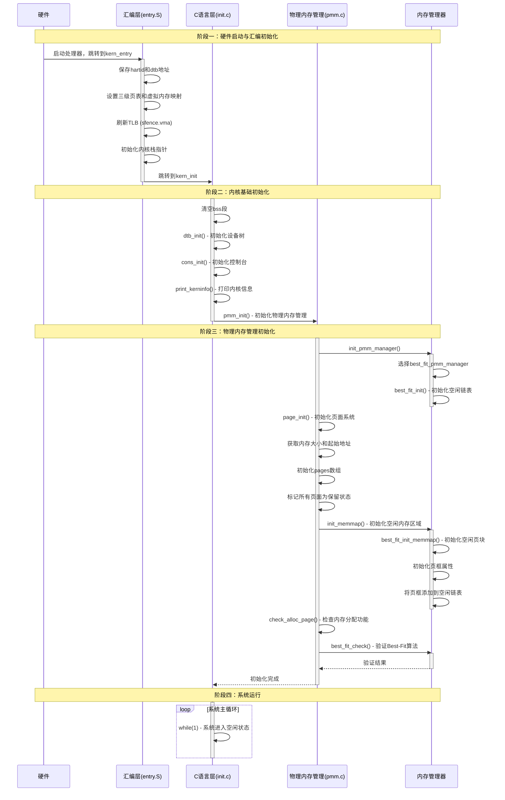

# LAB2

**23级信息安全  2310411 李听泉**

**23级信息安全  2313876 李子凝**

**23级信息安全  2312092 李朝阳**

> [!NOTE] 
>
> **小组分工：**
>
> 李子凝：
>
> 李朝阳：
>
> 李听泉：

----

## 练习1：理解first-fit 连续物理内存分配算法（思考题）

> [!important]
>
> first-fit 连续物理内存分配算法作为物理内存分配一个很基础的方法，需要同学们理解它的实现过程。请大家仔细阅读实验手册的教程并结合`kern/mm/default_pmm.c`中的相关代码，认真分析default_init，default_init_memmap，default_alloc_pages， default_free_pages等相关函数，并描述程序在进行物理内存分配的过程以及各个函数的作用。 请在实验报告中简要说明你的设计实现过程。请回答如下问题：
>
> - 你的first fit算法是否有进一步的改进空间？

### 1. first-fit算法实现分析

first-fit算法是一种连续物理内存分配算法，其核心思想是在空闲块列表中从头部开始查找，找到第一个足够大的空闲块进行分配。在ucore操作系统中，该算法通过`kern/mm/default_pmm.c`文件实现。

#### 1.1 核心数据结构

```c
// kern/mm/memlayout.h
struct Page {
    int ref;                        // 页帧的引用计数器
    uint64_t flags;                 // 描述页帧状态的标志位
    unsigned int property;          // 空闲块的页数，用于first fit内存管理器
    list_entry_t page_link;         // 空闲链表链接
};

// kern/mm/default_pmm.h
static free_area_t free_area;
#define free_list (free_area.free_list)  // 空闲块链表
#define nr_free (free_area.nr_free)      // 空闲页总数
```

#### 1.2 主要函数分析

##### 1.2.1 初始化函数：default_init

```c
static void
default_init(void) {
    list_init(&free_list);  // 初始化空闲链表
    nr_free = 0;            // 设置空闲页数量为0
}
```

该函数负责初始化物理内存管理器的基本数据结构，包括空闲链表和空闲页计数器。物理内存管理系统从这里开始。

##### 1.2.2 内存映射初始化：default_init_memmap

```c
static void
default_init_memmap(struct Page *base, size_t n) {
    assert(n > 0); // 确保初始化的内存块至少包含一个物理页
    struct Page *p = base;

    // 初始化内存块中的所有页
    for (; p != base + n; p ++) {
        assert(PageReserved(p)); // 检查当前的页面是否已经被标记为保留状态
        p->flags = p->property = 0; // 清除页的标志位
        set_page_ref(p, 0); // 准备好被分配
    }
    base->property = n; //设置块的大小，在内存块的第一个页中记录整个块的页数
    SetPageProperty(base); // 标记为属性页，表示是空闲块的头部页
    nr_free += n; // 更新空闲页的计数
    if (list_empty(&free_list)) {
        list_add(&free_list, &(base->page_link)); // 链表为空，则直接将内存块添加到链表中
    } else {
        list_entry_t* le = &free_list;
        // 不空的时候，首先遍历空闲链表，找到第一个物理地址大于当前内存块的页
        while ((le = list_next(le)) != &free_list) {
            struct Page* page = le2page(le, page_link);
            if (base < page) {
                list_add_before(le, &(base->page_link));
                break;
            } else if (list_next(le) == &free_list) {
                list_add(le, &(base->page_link)); // 如果遍历完都没有找到，则将内存块添加到链表末尾
            }
        }
    }
}
```

该函数负责初始化一段物理内存区域，将连续的n个物理页标记为空闲状态并加入空闲链表。主要步骤包括：

default_init_memmap 函数在操作系统物理内存管理中有如下的功能：

1. **内存初始化** ：将物理内存划分为以页为单位的管理单元
2. **空闲块管理** ：通过链表结构组织空闲内存块，支持后续的内存分配
3. **有序性维护** ：确保空闲链表按物理地址有序排列，为first-fit等分配算法提供基础
4. **元数据管理** ：维护页的状态信息（如引用计数、标志位、块大小等）

##### 1.2.3 分配函数：default_alloc_pages

```c
static struct Page *
default_alloc_pages(size_t n) {
    assert(n > 0);
    if (n > nr_free) {
        return NULL; // 没有足够的空闲页
    }
    struct Page *page = NULL; // 存储找到的空闲块的指针，初始化为NULL
    list_entry_t *le = &free_list; //le是链表遍历指针，初始化指向空闲链表的头部
    // first-fit核心算法：找到第一个足够大的空闲块
    while ((le = list_next(le)) != &free_list) {
        struct Page *p = le2page(le, page_link);
        if (p->property >= n) {
            page = p;
            break;
        }
    }
    // 找到了合适的空闲块
    if (page != NULL) {
        list_entry_t* prev = list_prev(&(page->page_link));
        list_del(&(page->page_link));

        // 块分裂：如果空闲块的大小 大于 请求的页数
        if (page->property > n) {
            struct Page *p = page + n; // 计算剩余部分的起始页地址
            p->property = page->property - n; // 设置剩余部分的块大小
            SetPageProperty(p); // 标记剩余部分为空闲块头部
            list_add(prev, &(p->page_link)); // 将剩余部分重新插入到空闲链表中
        }
        nr_free -= n;
        ClearPageProperty(page); // 清除已经分配块的属性位
    }
    return page;
}
```

该函数实现了first-fit分配策略，主要步骤包括：
1. 检查是否有足够的空闲页
2. 从空闲链表头开始查找第一个大小大于等于请求页数的空闲块
3. 如果找到合适的块，从空闲链表中移除
4. 如果空闲块大小大于请求页数，分割空闲块，并将剩余部分重新加入空闲链表
5. 更新空闲页总数并返回分配的页

##### 1.2.4 释放函数：default_free_pages

```c
static void
default_free_pages(struct Page *base, size_t n) {
    assert(n > 0);
    struct Page *p = base;
    for (; p != base + n; p ++) {
        assert(!PageReserved(p) && !PageProperty(p));
        p->flags = 0;  // 清除标志位
        set_page_ref(p, 0);  // 重置引用计数
    }
    
    base->property = n;  // 设置空闲块大小
    SetPageProperty(base);  // 标记为空闲块
    nr_free += n;  // 增加空闲页数量
    
    // 按地址顺序插入空闲链表
    if (list_empty(&free_list)) {
        list_add(&free_list, &(base->page_link));
    } else {
        list_entry_t* le = &free_list;
        while ((le = list_next(le)) != &free_list) {
            struct Page* page = le2page(le, page_link);
            if (base < page) {
                list_add_before(le, &(base->page_link));
                break;
            } else if (list_next(le) == &free_list) {
                list_add(le, &(base->page_link));
            }
        }
    }
    
    // 尝试与前面的空闲块合并
    list_entry_t* le = list_prev(&(base->page_link));
    if (le != &free_list) {
        p = le2page(le, page_link);
        if (p + p->property == base) {
            p->property += base->property;
            ClearPageProperty(base);
            list_del(&(base->page_link));
            base = p;
        }
    }
    
    // 尝试与后面的空闲块合并
    le = list_next(&(base->page_link));
    if (le != &free_list) {
        p = le2page(le, page_link);
        if (base + base->property == p) {
            base->property += p->property;
            ClearPageProperty(p);
            list_del(&(p->page_link));
        }
    }
}
```

该函数负责释放物理页并将其重新加入空闲链表，主要步骤包括：
1. 重置每个被释放页的标志位和引用计数
2. 设置空闲块首页的property字段和标志位
3. 按物理地址顺序插入空闲链表
4. 尝试与前面和后面的空闲块合并，减少内存碎片
5. 更新空闲页总数

#### 1.3 物理内存分配流程总结

ucore操作系统中first-fit物理内存分配的完整流程如下：

1. **初始化阶段**：
   - 调用`default_init`初始化空闲链表和计数器
   - 调用`default_init_memmap`将可用物理内存区域映射到页结构并加入空闲链表

2. **分配阶段**：
   - 调用`default_alloc_pages`从空闲链表头开始查找第一个足够大的空闲块
   - 如果找到合适块，进行分配并可能分割空闲块
   - 返回分配的页结构指针

3. **释放阶段**：
   - 调用`default_free_pages`将释放的页重新加入空闲链表
   - 按地址顺序插入并尝试与相邻空闲块合并

### 2. first-fit算法的改进空间

虽然first-fit算法实现简单且在某些场景下性能较好，但仍存在以下改进空间：

#### 2.1 性能优化

1. **改用best-fit算法**：选择大小最接近请求的空闲块，可以减少内存碎片。虽然查找时间可能增加，但空间利用率更高。

2. **改用next-fit算法**：从上一次分配的位置开始查找，而不是每次都从头开始，可以减少查找时间，特别是在大内存系统中。

3. **实现分离空闲链表**：为不同大小的空闲块维护单独的链表，如伙伴系统（buddy system），可以显著提高分配和释放的效率。

#### 2.2 内存碎片管理

1. **定期碎片整理**：添加后台任务定期执行内存碎片整理，将分散的小空闲块合并成大空闲块。

2. **页移动技术**：对于支持页移动的系统，可以在运行时将已分配的页内容移动，从而合并空闲块。

#### 2.3 多处理器支持

添加锁机制以支持多处理器环境下的并发内存分配和释放，如使用自旋锁或互斥锁保护空闲链表的访问。

#### 2.4 热点页缓存

为频繁分配的特定大小的页设置缓存，减少对空闲链表的频繁访问，提高分配效率。

#### 2.5 预测性分配

根据程序的内存访问模式进行预测性分配，减少分配操作的延迟。

### 3. 总结

first-fit算法是一种简单直观的连续物理内存分配策略，通过维护有序的空闲块链表，实现了基本的内存分配和释放功能。其核心优势在于实现简单、分配速度快（在内存充足的情况下），但也存在容易产生内存碎片、大内存系统中查找效率较低等不足。通过采用更高级的分配算法（如best-fit、伙伴系统）和添加碎片管理机制，可以进一步提高物理内存的管理效率和利用率。


## 练习2：实现 Best-Fit 连续物理内存分配算法（需要编程）

> [!important]
>
> 在完成练习一后，参考kern/mm/default_pmm.c对First Fit算法的实现，编程实现Best Fit页面分配算法，算法的时空复杂度不做要求，能通过测试即可。 请在实验报告中简要说明你的设计实现过程，阐述代码是如何对物理内存进行分配和释放，并回答如下问题：
>
> - 你的 Best-Fit 算法是否有进一步的改进空间？
> - 


##  扩展练习Challenge：buddy system（伙伴系统）分配算法（需要编程）

> [!important]
>
> Buddy System算法把系统中的可用存储空间划分为存储块(Block)来进行管理, 每个存储块的大小必须是2的n次幂(Pow(2, n)), 即1, 2, 4, 8, 16, 32, 64, 128...
>
> - 参考[伙伴分配器的一个极简实现](http://coolshell.cn/articles/10427.html)， 在ucore中实现buddy system分配算法，要求有比较充分的测试用例说明实现的正确性，需要有设计文档。


## 扩展练习Challenge：任意大小的内存单元slub分配算法（需要编程）

> [!important]
>
> slub算法，实现两层架构的高效内存单元分配，第一层是基于页大小的内存分配，第二层是在第一层基础上实现基于任意大小的内存分配。可简化实现，能够体现其主体思想即可。
>
> - 参考[linux的slub分配算法/](https://github.com/torvalds/linux/blob/master/mm/slub.c)，在ucore中实现slub分配算法。要求有比较充分的测试用例说明实现的正确性，需要有设计文档。


## 扩展练习Challenge：硬件的可用物理内存范围的获取方法（思考题）

> [!important]
>
> - 如果 OS 无法提前知道当前硬件的可用物理内存范围，请问你有何办法让 OS 获取可用物理内存范围？


## 本实验中重要的知识点（OS中也出现）


### 1. ucore内核启动时内存管理系统的启动流程

#### 1.1 系统启动入口：kern_entry (entry.S)

- 保存hartid和dtb地址到内存变量中

  ```assembly
  la t0, boot_hartid # hartid当前运行的线程ID
  sd a0, 0(t0) # 保存当前运行的线程ID
  la t0, boot_dtb # 设备树blob的物理地址
  sd a1, 0(t0) # 保存设备树blob的物理地址到$a1
  ```

- 设置三级页表和虚拟内存映射：
  ```assembly
  # 计算boot_page_table_sv39的物理地址
  lui     t0, %hi(boot_page_table_sv39) # 存储了根页表的虚拟地址
  li      t1, 0xffffffffc0000000 - 0x80000000 # 虚实映射偏移量
  sub     t0, t0, t1 # 减去偏移量，得到物理地址
  srli    t0, t0, 12 # 右移12位，得到物理页号
  
  # 设置satp寄存器为Sv39模式并加载页表基址
  li      t1, 8 << 60 # 8表示Sv39模式
  or      t0, t0, t1 # 组合模式位和物理页号
  csrw    satp, t0 # 写入satp寄存器
  
  # 执行sfence.vma指令刷新TLB
  sfence.vma # 刷新TLB，使页表生效
  ```
  
- 初始化内核栈指针(sp)为bootstacktop：
  ```assembly
  lui sp, %hi(bootstacktop) # 设置栈指针为bootstacktop
  addi sp, sp, %lo(bootstacktop) # 加上页内偏移，指向栈顶
  ```
  
- 跳转到kern_init函数：
  ```assembly
  lui t0, %hi(kern_init) # 加载kern_init的高20位
  addi t0, t0, %lo(kern_init) # 加载kern_init的低12位
  jr t0 # 跳转到kern_init
  ```
  
  > [!note]
  >
  > 这里的`kern_init`加载地址的逻辑不太清楚，查询后得知
  >
  > 1. RISC-V指令格式无法直接编码完整的64位立即数，需要两个指令组合完成
  > 2. 由于`kern_init`的虚拟地址 `0xFFFFFFFFC0200000` 是高位地址，其高20位 `0xC0200` 的最高位为1，`lui`执行的时候，会自动将其符号扩展为正确的地址

#### 1.2 内核初始化：kern_init (init.c)

```c++
memset(edata, 0, end - edata); //清空bss段内存
dtb_init();        // 初始化设备树
cons_init();       // 初始化控制台
print_kerninfo();  // 打印内核信息
pmm_init();        // 初始化物理内存管理
while (1);
```

#### 1.3 物理内存管理初始化：pmm_init (pmm.c)

```c
/* pmm_init - initialize the physical memory management */
void pmm_init(void) {
    //我们需要分配/释放物理内存（粒度为4KB或其他大小）。
    //因此，在pmm.h中定义了一个物理内存管理器框架（struct pmm_manager）
    //首先，我们应该基于框架初始化一个物理内存管理器（pmm）。
    //然后pmm可以分配/释放物理内存。
    //现在第一个_fit/best_fit/worst_fit/buddy_system pmm可用。
    init_pmm_manager();

    // 检测物理内存空间、保留已使用的内存，
    // 然后使用pmm->init_memmap创建空闲页面列表
    page_init();

    // 使用pmm->check验证pmm中alloc/free函数的正确性
    check_alloc_page();

    // 获取启动页表的虚拟地址和物理地址
    extern char boot_page_table_sv39[];
    satp_virtual = (pte_t*)boot_page_table_sv39;
    satp_physical = PADDR(satp_virtual);
    cprintf("satp virtual address: 0x%016lx\nsatp physical address: 0x%016lx\n", satp_virtual, satp_physical);
}

static void check_alloc_page(void) {
    pmm_manager->check();
    cprintf("check_alloc_page() succeeded!\n");
}
```
#### 1.4 内存管理器初始化：init_pmm_manager (pmm.c) 

> [!note]
>
> 这里由 `pmm_manager` 选择合适的内存管理器

```c
// init_pmm_manager - initialize a pmm_manager instance
static void init_pmm_manager(void) {
    // 选择最佳适配(best_fit)算法作为内存管理器
    pmm_manager = &best_fit_pmm_manager;
    
    // 打印当前使用的内存管理器名称
    cprintf("memory management: %s\n", pmm_manager->name);
    
    // 初始化内存管理器内部数据结构
    pmm_manager->init();
}
```
#### 1.5 页面系统初始化：page_init (pmm.c)

```c
static void page_init(void) {
    // 设置虚拟地址到物理地址的偏移量
    va_pa_offset = PHYSICAL_MEMORY_OFFSET;

    // 从DTB获取物理内存信息
    uint64_t mem_begin = get_memory_base();
    uint64_t mem_size  = get_memory_size();
    if (mem_size == 0) {
        panic("DTB memory info not available");
    }
    uint64_t mem_end   = mem_begin + mem_size;

    // 打印物理内存映射信息
    cprintf("physcial memory map:\n");
    cprintf("  memory: 0x%016lx, [0x%016lx, 0x%016lx].\n", mem_size, mem_begin,
            mem_end - 1);

    // 确定最大物理地址，不超过内核虚拟地址空间上限
    uint64_t maxpa = mem_end;
    if (maxpa > KERNTOP) {
        maxpa = KERNTOP;
    }

    // 获取内核结束位置
    extern char end[];

    // 计算物理页数
    npage = maxpa / PGSIZE;
    
    // 在内核结束位置之后初始化页结构数组
    pages = (struct Page *)ROUNDUP((void *)end, PGSIZE);

    // 标记所有物理页为保留状态
    for (size_t i = 0; i < npage - nbase; i++) {
        SetPageReserved(pages + i);
    }

    // 计算可用空闲内存的起始地址
    uintptr_t freemem = PADDR((uintptr_t)pages + sizeof(struct Page) * (npage - nbase));

    // 对齐内存边界并初始化空闲页列表
    mem_begin = ROUNDUP(freemem, PGSIZE);
    mem_end = ROUNDDOWN(mem_end, PGSIZE);
    if (freemem < mem_end) {
        init_memmap(pa2page(mem_begin), (mem_end - mem_begin) / PGSIZE);
    }
}
```
#### 1.6 空闲内存区域初始化：init_memmap (pmm.c)

```c
// init_memmap - call pmm->init_memmap to build Page struct for free memory
static void init_memmap(struct Page *base, size_t n) {
    // 调用当前内存管理器的init_memmap函数，
    // 初始化从base开始的n个连续物理页
    pmm_manager->init_memmap(base, n);
}
```

#### 1.7 Best-Fit算法内存映射初始化：best_fit_init_memmap (best_fit_pmm.c)

- 初始化每个页框的标志、属性和引用计数
- 设置第一个页框的property属性为块大小n
- 标记第一个页框为PG_property
- 更新空闲页计数(nr_free += n)
- 将页框添加到空闲链表中的正确位置(按地址排序)

#### 1.8 内存分配功能检查：check_alloc_page (pmm.c)

- 调用pmm_manager->check(即best_fit_check)来验证内存分配功能
- 打印检查成功信息




## 本实验中重要的知识点（OS中没有）

### 初始化设备树：dtb_init()实现的内容

### 初始化控制台：cons_init()实现的内容

## OS原理中很重要，但在实验中没有对应上的知识点


```mermaid

```

