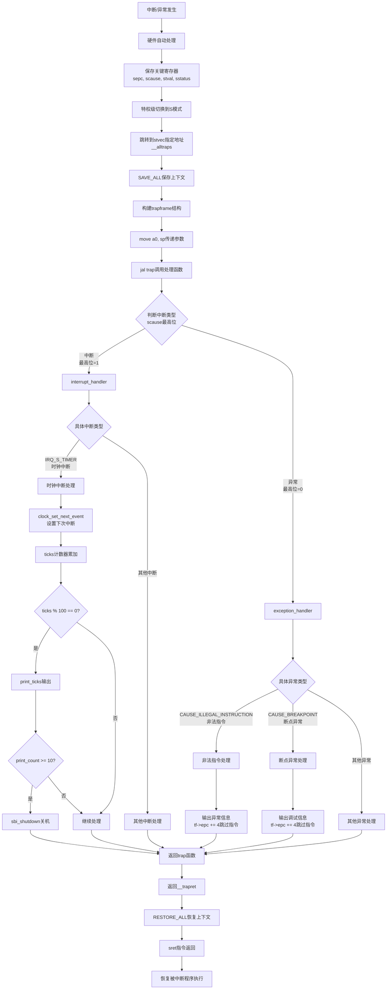

# Lab3 实验报告：断,都可以断

**23级信息安全  2310411 李听泉**

**23级信息安全  2313876 李子凝**

**23级信息安全  2312092 李朝阳**

> [!NOTE] 
>
> **小组分工：**
>
> 李子凝：负责challenge2实现以及OS与实验之间的知识点
>
> 李朝阳：负责challenge1实现以及练习2内容
>
> 李听泉：负责challenge3以及练习一

## 实验目的

通过本次实验，我学习并掌握了以下内容：
- RISC-V架构的中断相关知识
- 中断前后上下文环境的保存与恢复机制
- 如何处理断点中断和时钟中断

## 实验内容

### 扩展练习 Challenge1：描述与理解中断流程

#### ucore中处理中断异常的完整流程

1. **中断触发**：当CPU执行过程中发生异常或收到外部中断信号时，会暂停当前程序执行。

2. **硬件自动保存部分上下文**：硬件会自动将触发中断的指令地址保存到`sepc`寄存器，并将中断原因保存到`scause`寄存器。

3. **跳转到中断入口点**：CPU根据`stvec`寄存器中设置的地址（即`__alltraps`）跳转到中断处理程序入口。

4. **保存完整上下文**：在`__alltraps`中调用`SAVE_ALL`宏，将所有通用寄存器和关键CSR保存到栈上。

5. **参数传递**：通过`move a0, sp`将栈指针传递给C语言处理函数，使`trap`函数能够访问到保存的上下文。

6. **分发处理**：`trap`函数调用`trap_dispatch`根据中断类型分发到`interrupt_handler`或`exception_handler`。

7. **具体处理**：根据具体的中断/异常原因执行相应的处理逻辑。

8. **恢复上下文**：处理完成后，通过`__trapret`中的`RESTORE_ALL`宏恢复所有寄存器。

9. **返回执行**：执行`sret`指令，返回到中断发生前的程序继续执行。



#### `mov a0, sp`的目的

`mov a0, sp`的作用是将栈指针作为参数传递给`trap`函数。在RISC-V的调用约定中，`a0`寄存器用于传递第一个函数参数。由于我们已经在栈上构建了完整的`trapframe`结构体，将栈指针传递给`trap`函数就相当于传递了整个中断上下文，使C语言处理函数能够访问并修改保存的寄存器和状态信息。

#### SAVE_ALL中寄存器保存在栈中的位置确定方式

寄存器在栈中的位置是由`trapframe`结构体的定义确定的。在`trap.h`中，`trapframe`结构体按特定顺序定义了所有需要保存的寄存器：

1. 首先是32个通用寄存器（通过`pushregs`结构体）
2. 然后是4个关键的CSR寄存器：`sstatus`、`sepc`、`badvaddr`、`cause`

在`SAVE_ALL`宏中，我们按照这个结构体的顺序依次将寄存器保存到栈上，并为整个结构体预留了足够的空间（36个寄存器宽度）。

#### 是否需要保存所有寄存器

是的，对于任何中断都需要保存所有寄存器。原因如下：

1. **通用性**：中断处理程序不知道中断发生前正在执行什么程序，需要保存所有可能被使用的寄存器以确保正确恢复。

2. **原子性**：中断处理应该对用户程序透明，就像什么都没发生过一样继续执行。

3. **安全边界**：中断处理程序运行在内核态，可能会修改寄存器，必须确保返回用户态时所有寄存器都恢复到中断前的值。

4. **调用约定**：虽然有些寄存器（如临时寄存器）在调用约定中由调用者保存，但为了保证中断处理的完整性和一致性，保存所有寄存器是最安全的做法。

### 扩展练习 Challenge2：理解上下文切换机制

#### `csrw sscratch, sp`和`csrrw s0, sscratch, x0`实现的操作

这两条指令实现了一个巧妙的寄存器交换操作：

1. **`csrw sscratch, sp`**：将当前的栈指针保存到`sscratch`寄存器中。这一步保存了中断发生前的栈顶位置。

2. **`csrrw s0, sscratch, x0`**：这是一个原子的读-写交换操作。它将`sscratch`的内容（即之前保存的栈指针）读入`s0`寄存器，同时将0写入`sscratch`。

#### 这些操作的目的

1. **保存原始栈指针**：通过这两步操作，我们成功地将中断发生前的栈指针保存到了`s0`寄存器中，以便稍后将其保存到`trapframe`结构体中。

2. **标识状态**：将`sscratch`设为0表示当前处于内核态。这对于区分内核态和用户态的中断处理非常重要。

3. **实现巧妙的保存机制**：这种设计允许我们在不破坏其他寄存器的情况下，安全地保存原始栈指针。

#### 为什么SAVE_ALL保存CSR但RESTORE_ALL不还原它们

SAVE_ALL保存`stval`、`scause`等CSR的意义在于：

1. **诊断和调试**：这些寄存器包含了中断发生时的重要信息，保存它们可以用于调试和错误报告。

2. **处理决策**：中断处理程序需要访问这些信息来决定如何处理不同类型的中断或异常。

而RESTORE_ALL不还原它们的原因是：

1. **不需要恢复**：这些CSR只记录了中断发生时的状态，并不属于程序执行上下文的一部分。

2. **会被硬件更新**：当程序继续执行时，这些寄存器的值会被硬件重新设置，恢复它们没有意义。

3. **sepc特殊处理**：唯一需要特殊处理的是`sepc`寄存器，但它在RESTORE_ALL中已经被单独恢复，因为它决定了程序恢复执行的位置。

4. **安全性考虑**：随意修改这些控制寄存器可能会导致系统不稳定或安全问题。

### 练习1：完善中断处理

我在`trap.c`中实现了时钟中断处理功能，具体实现如下：

1. 添加了一个全局变量`print_count`用于记录打印次数
2. 在时钟中断处理函数中：
   - 调用`clock_set_next_event()`设置下次时钟中断
   - 将`ticks`计数器加一
   - 当`ticks`计数器达到100时，调用`print_ticks()`打印"100 ticks"
   - 增加`print_count`计数
   - 当`print_count`达到10时，调用`sbi_shutdown()`函数关机

**实现代码片段：**
```c
static int print_count = 0; // 打印计数变量

// 在IRQ_S_TIMER处理中：
clock_set_next_event();
ticks++;
if (ticks % TICK_NUM == 0) {
    print_ticks();
    print_count++;
    if (print_count >= 10) {
        extern void sbi_shutdown();
        sbi_shutdown();
    }
}
```

### 扩展练习Challenge3：完善异常中断

我还实现了对非法指令异常和断点异常的处理：

1. 对于非法指令异常：
   - 输出异常类型"Exception type: Illegal instruction"
   - 输出异常指令地址"Illegal instruction caught at 0x..."
   - 更新`tf->epc`寄存器，跳过当前指令

2. 对于断点异常：
   - 输出异常类型"Exception type: breakpoint"
   - 输出异常指令地址"ebreak caught at 0x..."
   - 更新`tf->epc`寄存器，跳过当前指令

**实现代码片段：**
```c
case CAUSE_ILLEGAL_INSTRUCTION:
    cprintf("Exception type: Illegal instruction\n");
    cprintf("Illegal instruction caught at 0x%08x\n", tf->epc);
    tf->epc += 4; // 假设每条指令占4字节
    break;
case CAUSE_BREAKPOINT:
    cprintf("Exception type: breakpoint\n");
    cprintf("ebreak caught at 0x%08x\n", tf->epc);
    tf->epc += 4; // 假设每条指令占4字节
    break;
```

## 实验运行结果

编译并运行系统后，成功实现了预期功能：
- 系统每秒钟打印一次"100 ticks"
- 打印10次后自动关机

## 重要知识点总结

### RISC-V中断机制

1. **中断概念**：中断是CPU响应外部事件或内部异常的机制，使CPU能够暂时停止当前任务，处理紧急事件，然后返回继续执行。

2. **中断分类**：
   - 异常(Exception)：执行指令过程中发生的错误
   - 陷入(Trap)：主动通过指令停下来(如系统调用、断点)
   - 外部中断(Interrupt)：外设发来的信号

3. **关键CSR寄存器**：
   - `sstatus`：包含中断使能位SIE
   - `stvec`：中断向量表基址寄存器
   - `sepc`：记录触发中断的指令地址
   - `scause`：记录中断原因
   - `stval`：记录辅助信息

### 上下文保存与恢复

1. **中断帧(TrapFrame)**：用于保存中断发生时的CPU上下文
2. **SAVE_ALL宏**：保存所有通用寄存器和关键CSR到栈中
3. **RESTORE_ALL宏**：从栈中恢复寄存器内容

### 时钟中断处理

1. **时钟初始化**：设置第一个时钟中断事件
2. **时钟中断处理**：每次触发时钟中断时设置下一次事件，更新计数器

## OS原理与实验对比

### 实验中覆盖的OS原理知识点

1. **中断处理机制**：实验完整实现了中断的捕获、分发和处理流程
2. **上下文切换**：通过汇编代码实现了高效的上下文保存和恢复
3. **中断优先级**：通过控制中断使能位实现了中断的开关
4. **定时器管理**：实现了基于定时器的周期性任务调度基础

### OS原理中重要但实验中未覆盖的知识点

1. **中断嵌套**：实验中没有处理中断嵌套的情况
2. **中断优先级管理**：没有实现多级中断优先级
3. **用户态中断处理**：实验主要关注内核态的中断处理
4. **系统调用机制**：虽然有ecall指令的处理框架，但没有实现完整的系统调用

## 实验心得

通过本次实验，我深入理解了操作系统中断处理的核心机制。特别是在RISC-V架构下，如何通过精心设计的汇编代码和C语言代码协作，实现高效的中断处理。中断机制是操作系统与硬件交互的重要桥梁，也是实现多任务调度的基础。

在实现过程中，我注意到了很多细节问题，比如寄存器的保存顺序、epc寄存器的正确更新等，这些细节对于保证中断处理的正确性至关重要。同时，我也体会到了操作系统设计中需要平衡性能和功能的挑战。