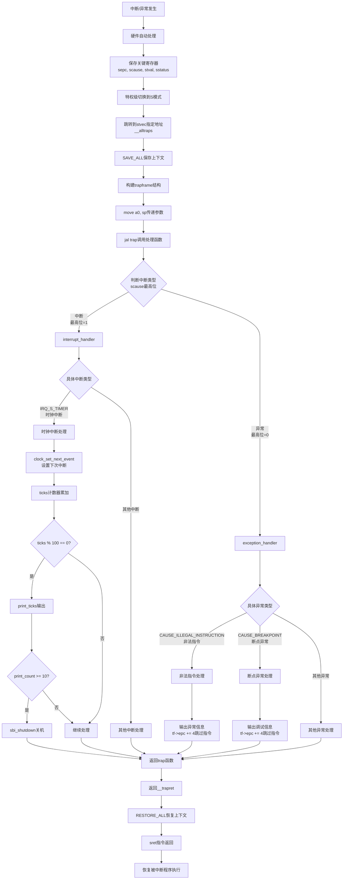
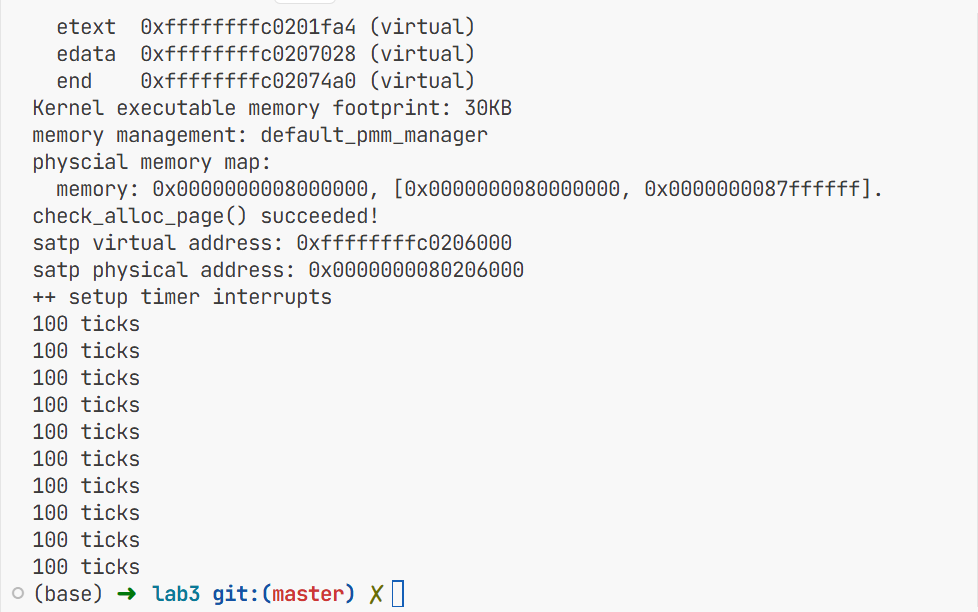

# Lab3 实验报告：断,都可以断

**23级信息安全  2310411 李听泉**

**23级信息安全  2313876 李子凝**

**23级信息安全  2312092 李朝阳**

> [!NOTE] 
>
> **小组分工：**
>
> 李子凝：负责challenge2实现以及OS与实验之间的知识点
>
> 李朝阳：负责challenge1实现以及练习2内容
>
> 李听泉：负责challenge3以及练习一

## 实验目的

通过本次实验，我学习并掌握了以下内容：
- RISC-V架构的中断相关知识
- 中断前后上下文环境的保存与恢复机制
- 如何处理断点中断和时钟中断

## 实验内容

### 扩展练习 Challenge1：描述与理解中断流程

#### ucore中处理中断异常的完整流程

1. **中断触发**：当CPU执行过程中发生异常或收到外部中断信号时，会暂停当前程序执行。

2. **硬件自动保存部分上下文**：硬件会自动将触发中断的指令地址保存到`sepc`寄存器，并将中断原因保存到`scause`寄存器。

3. **跳转到中断入口点**：CPU根据`stvec`寄存器中设置的地址（即`__alltraps`）跳转到中断处理程序入口。

4. **保存完整上下文**：在`__alltraps`中调用`SAVE_ALL`宏，将所有通用寄存器和关键CSR保存到栈上。

5. **参数传递**：通过`move a0, sp`将栈指针传递给C语言处理函数，使`trap`函数能够访问到保存的上下文。

6. **分发处理**：`trap`函数调用`trap_dispatch`根据中断类型分发到`interrupt_handler`或`exception_handler`。

7. **具体处理**：根据具体的中断/异常原因执行相应的处理逻辑。

8. **恢复上下文**：处理完成后，通过`__trapret`中的`RESTORE_ALL`宏恢复所有寄存器。

9. **返回执行**：执行`sret`指令，返回到中断发生前的程序继续执行。



#### `mov a0, sp`的目的

`mov a0, sp`的作用是将栈指针作为参数传递给`trap`函数。在RISC-V的调用约定中，`a0`寄存器用于传递第一个函数参数。由于我们已经在栈上构建了完整的`trapframe`结构体，将栈指针传递给`trap`函数就相当于传递了整个中断上下文，使C语言处理函数能够访问并修改保存的寄存器和状态信息。

#### SAVE_ALL中寄存器保存在栈中的位置确定方式

寄存器在栈中的位置是由`trapframe`结构体的定义确定的。在`trap.h`中，`trapframe`结构体按特定顺序定义了所有需要保存的寄存器：

1. 首先是32个通用寄存器（通过`pushregs`结构体）
2. 然后是4个关键的CSR寄存器：`sstatus`、`sepc`、`badvaddr`、`cause`

在`SAVE_ALL`宏中，我们按照这个结构体的顺序依次将寄存器保存到栈上，并为整个结构体预留了足够的空间（36个寄存器宽度）。

#### 是否需要保存所有寄存器

是的，对于任何中断都需要保存所有寄存器。原因如下：

1. **通用性**：中断处理程序不知道中断发生前正在执行什么程序，需要保存所有可能被使用的寄存器以确保正确恢复。

2. **原子性**：中断处理应该对用户程序透明，就像什么都没发生过一样继续执行。

3. **安全边界**：中断处理程序运行在内核态，可能会修改寄存器，必须确保返回用户态时所有寄存器都恢复到中断前的值。

4. **调用约定**：虽然有些寄存器（如临时寄存器）在调用约定中由调用者保存，但为了保证中断处理的完整性和一致性，保存所有寄存器是最安全的做法。

### 扩展练习 Challenge2：理解上下文切换机制
#### 问题1：`csrw sscratch, sp; csrrw s0, sscratch, x0` 的操作和目的？
##### 代码分析

```assembly
# 在SAVE_ALL宏中：
csrw sscratch, sp       # 将当前sp保存到sscratch
# ... 保存其他寄存器 ...
csrrw s0, sscratch, x0  # 将sscratch的值读到s0，同时将sscratch清0
STORE s0, 2*REGBYTES(sp) # 将原sp值保存到trapframe中
```

##### 详细执行过程

###### 步骤1：保存原栈指针

```assembly
csrw sscratch, sp  # 把当前的栈指针保存到sscratch寄存器
```

此时`sscratch` = 中断发生时的栈指针值。

###### 步骤2：分配栈空间后

```assembly
addi sp, sp, -36 * REGBYTES  # 在栈上分配trapframe空间
# 现在sp指向新分配的trapframe起始地址
```

###### 步骤3：读取并清空sscratch

```assembly
csrrw s0, sscratch, x0  # 原子操作：s0 = sscratch, sscratch = x0(0)
```

该指令主要有两个操作：

1. 读取 `sscratch` 的值到 `s0`
2. 同时将 `x0` (恒为0) 写入 `sscratch`

##### 目的

1. **保存中断发生时的栈指针**。我们需要在trapframe中保存的是中断发生时的sp，而不是当前的sp，所以需要将中断时的sp提前保存在sscratch寄存器中用于后续使用。
2. **清空sscratch为内核态标记**。sscratch的约定用法为若为0，则表示中断来自内核态；若为非0， 表示中断来自用户态，存储内核栈指针。因此`csrrw s0, sscratch, x0`在读取sp同时也按照约定将sscratch清0，标记为内核态中断。
3. **实现巧妙的保存机制**：这种设计允许我们在不破坏其他寄存器的情况下，安全地保存原始栈指针。

#### 问题2：为什么保存stval、scause但不恢复它们？store的意义何在？

##### 保存的CSR寄存器

```assembly
# 在SAVE_ALL中保存：
csrr s1, sstatus    # 状态寄存器 - 需要恢复
csrr s2, sepc       # 异常PC - 需要恢复  
csrr s3, sbadaddr   # 错误地址 - 不需要恢复
csrr s4, scause     # 异常原因 - 不需要恢复

STORE s1, 32*REGBYTES(sp)  # sstatus - 恢复
STORE s2, 33*REGBYTES(sp)  # sepc    - 恢复
STORE s3, 34*REGBYTES(sp)  # sbadaddr - 不恢复
STORE s4, 35*REGBYTES(sp)  # scause   - 不恢复
```
SAVE_ALL保存`stval`、`scause`等CSR的意义在于：

1. **诊断和调试**：这些寄存器包含了中断发生时的重要信息，保存它们可以用于调试和错误报告。

2. **处理决策**：中断处理程序需要访问这些信息来决定如何处理不同类型的中断或异常。
##### 需要恢复的CSR寄存器

###### 1. `sstatus` - 必须恢复

```c
// sstatus包含关键状态信息：
// - SIE: 中断使能位
// - SPP: 之前特权模式
// - SPIE: 之前中断使能状态
// 这些状态直接影响后续执行，必须恢复
```

###### 2. `sepc` - 必须恢复

```c
// sepc是返回地址，决定sret后从哪里继续执行
```

##### 不需要恢复的CSR寄存器

###### 1. `scause` - 只读的"现场证据"

```c
// scause的作用：
// - 记录中断/异常的原因（只读）
// - 用于诊断和分发处理
// - 处理完成后就失去作用
// 因此没必要恢复
```

###### 2. `sbadaddr` (stval) - 只读的附加信息

```c
// sbadaddr的作用：
// - 页错误：出错的虚拟地址
// - 非法指令：指令内容
// - 对齐错误：出错地址

// 这些是"只读的现场信息"，处理完成后就不需要了
// 因此同样没必要恢复
```

#####
而RESTORE_ALL不还原它们的原因是：

1. **不需要恢复**：这些CSR只记录了中断发生时的状态，并不属于程序执行上下文的一部分。

2. **会被硬件更新**：当程序继续执行时，这些寄存器的值会被硬件重新设置，恢复它们没有意义。

3. **sepc特殊处理**：唯一需要特殊处理的是`sepc`寄存器，但它在RESTORE_ALL中已经被单独恢复，因为它决定了程序恢复执行的位置。

4. **安全性考虑**：随意修改这些控制寄存器可能会导致系统不稳定或安全问题。
   
##### store的意义

1. **使C代码能够访问这些CSR值**。C语言无法直接访问CSR，CSR是处理器特有的寄存器，C语言标准没有定义访问CSR的语法，编译器不知道`scause`、`stval`这些特殊寄存器，因此必须要通过通用寄存器或内存栈进行传递。

2. **保持中断发生时所有状态的完整性**，**为复杂的异常处理提供完整上下文**。由于汇编到C的参数传递约束：

   ```assembly
   # 如果我们尝试直接传递：
   __alltraps:
       csrr a0, scause    # 把scause作为第一个参数
       csrr a1, stval     # 把stval作为第二个参数  
       jal trap           # 调用C函数
   
   # 但在C函数中：
   void trap(uint64_t cause, uint64_t stval) {
       // 问题：我们还需要其他CSR和所有通用寄存器！
       // 需要sstatus来判断之前模式
       // 需要sepc来知道返回地址  
       // 需要所有寄存器来完整保存上下文
   }
   ```

   而中断处理需要完整的上下文保存需求，因此我们以结构体的形式把所有寄存器值均存放在栈上供函数使用更加规范可靠，方便函数读取使用。


### 练习1：完善中断处理

我在`trap.c`中实现了时钟中断处理功能，具体实现如下：

1. 添加了一个全局变量`print_count`用于记录打印次数
2. 在时钟中断处理函数中：
   - 调用`clock_set_next_event()`设置下次时钟中断
   - 将`ticks`计数器加一
   - 当`ticks`计数器达到100时，调用`print_ticks()`打印"100 ticks"
   - 增加`print_count`计数
   - 当`print_count`达到10时，调用`sbi_shutdown()`函数关机

**实现代码片段：**
```c
static int print_count = 0; // 打印计数变量

// 在IRQ_S_TIMER处理中：
clock_set_next_event();
ticks++;
if (ticks % TICK_NUM == 0) {
    print_ticks();
    print_count++;
    if (print_count >= 10) {
        extern void sbi_shutdown();
        sbi_shutdown();
    }
}
```

### 扩展练习Challenge3：完善异常中断

实现了对非法指令异常和断点异常的处理：

1. 对于非法指令异常：
   - 输出异常类型"Exception type: Illegal instruction"
   - 输出异常指令地址"Illegal instruction caught at 0x..."
   - 更新`tf->epc`寄存器，跳过当前指令

2. 对于断点异常：
   - 输出异常类型"Exception type: breakpoint"
   - 输出异常指令地址"ebreak caught at 0x..."
   - 更新`tf->epc`寄存器，跳过当前指令

**实现代码片段：**
```c
case CAUSE_ILLEGAL_INSTRUCTION:
    cprintf("Exception type: Illegal instruction\n");
    cprintf("Illegal instruction caught at 0x%08x\n", tf->epc);
    tf->epc += 4; // 假设每条指令占4字节
    break;
case CAUSE_BREAKPOINT:
    cprintf("Exception type: breakpoint\n");
    cprintf("ebreak caught at 0x%08x\n", tf->epc);
    tf->epc += 4; // 假设每条指令占4字节
    break;
```

> [!NOTE]
>
> 我们在`init.c`中增加了异常指令的测试，但是硬件判断出`cause` 值为 `0x0000000d`，但是在`riscv.h`中并没有定义这个异常值
>
> - 异常处理机制 ：
>   - 在 `kern/trap/trap.c` 中， `trap_dispatch` 函数根据 `cause` 值判断是中断还是异常
>   - 对于未明确处理的异常类型，会调用 `print_trapframe(tf)` 打印完整的陷阱帧信息
>
> - 死循环原因 ：
>   - 从终端输出可以看到 `cause` 值为 `0x0000000d` （十进制13）
>   - 这个值对应的异常类型在 `exception_handler` 函数中没有明确处理
>   - 当异常发生后，系统没有正确修改 `epc` 寄存器跳过异常指令，导致异常指令被反复执行
>   - 每次执行都会触发相同的异常，进入异常处理，打印`trapframe`，形成无限循环
>
> - 解决方法 ：
>   - 在 `exception_handler` 函数中添加对该异常类型的处理，修改 `tf->epc` 跳过异常指令
>   - 或者在 `init.c` 中检查非法指令测试代码，确保指令格式正确
>


## 实验运行结果

编译并运行系统后，成功实现了预期功能：
- 系统每秒钟打印一次"100 ticks"
- 打印10次后自动关机



## 重要知识点总结

### RISC-V中断机制

1. **中断概念**：中断是CPU响应外部事件或内部异常的机制，使CPU能够暂时停止当前任务，处理紧急事件，然后返回继续执行。

2. **中断分类**：
   - 异常(Exception)：执行指令过程中发生的错误
   - 陷入(Trap)：主动通过指令停下来(如系统调用、断点)
   - 外部中断(Interrupt)：外设发来的信号

3. **关键CSR寄存器**：
   - `sstatus`：包含中断使能位SIE
   - `stvec`：中断向量表基址寄存器
   - `sepc`：记录触发中断的指令地址
   - `scause`：记录中断原因
   - `stval`：记录辅助信息

### 上下文保存与恢复

1. **中断帧(TrapFrame)**：用于保存中断发生时的CPU上下文
2. **SAVE_ALL宏**：保存所有通用寄存器和关键CSR到栈中
3. **RESTORE_ALL宏**：从栈中恢复寄存器内容

### 时钟中断处理

1. **时钟初始化**：设置第一个时钟中断事件
2. **时钟中断处理**：每次触发时钟中断时设置下一次事件，更新计数器

## OS原理与实验对比

### 实验中覆盖的OS原理知识点

1. **中断处理机制**：实验完整实现了中断的捕获、分发和处理流程
2. **上下文切换**：通过汇编代码实现了高效的上下文保存和恢复
3. **中断优先级**：通过控制中断使能位实现了中断的开关
4. **定时器管理**：实现了基于定时器的周期性任务调度基础

### OS原理中重要但实验中未覆盖的知识点

1. **中断嵌套**：实验中没有处理中断嵌套的情况
2. **中断优先级管理**：没有实现多级中断优先级
3. **用户态中断处理**：实验主要关注内核态的中断处理
4. **系统调用机制**：虽然有ecall指令的处理框架，但没有实现完整的系统调用

## 实验心得

通过本次实验，我深入理解了操作系统中断处理的核心机制。特别是在RISC-V架构下，如何通过精心设计的汇编代码和C语言代码协作，实现高效的中断处理。中断机制是操作系统与硬件交互的重要桥梁，也是实现多任务调度的基础。

在实现过程中，我注意到了很多细节问题，比如寄存器的保存顺序、epc寄存器的正确更新等，这些细节对于保证中断处理的正确性至关重要。同时，我也体会到了操作系统设计中需要平衡性能和功能的挑战。
